# 🏗️ ATLAS Framework Design Principles

**Architectural Foundation for Intelligent Taxonomy Systems**

[](https://github.com/atlas-framework/atlas)
[](https://pydantic.dev)
[](https://tailscale.com)

---

## 📋 Table of Contents

- [🎯 Core Philosophy](#-core-philosophy)
- [🔄 Composition Over Inheritance](#-composition-over-inheritance)
- [⚡ Type Safety First](#-type-safety-first)
- [🤖 AI-Native Architecture](#-ai-native-architecture)
- [🔒 Security by Design](#-security-by-design)
- [📊 Configuration-Driven Development](#-configuration-driven-development)
- [🎨 Behavioral Composition](#-behavioral-composition)
- [🕸️ Graph-Centric Design](#️-graph-centric-design)
- [🚀 Performance Principles](#-performance-principles)
- [👥 Community-Driven Evolution](#-community-driven-evolution)

---

## 🎯 Core Philosophy

ATLAS Framework is built on the fundamental principle that **intelligent systems should be composable, type-safe, and secure by default**. Our architecture eliminates common anti-patterns while embracing modern Python best practices.

### **🌟 Guiding Principles**


### **🎯 Design Goals**

1. **🔄 Eliminate Code Duplication**: True DRY principles through composition
2. **⚡ Maximize Type Safety**: Comprehensive validation and constraints
3. **🤖 Native AI Integration**: First-class support for intelligent behaviors
4. **🔒 Security by Default**: Zero-trust architecture from the ground up
5. **📊 Configuration-Driven**: Reduce code complexity through declarative configuration
6. **🚀 Performance Optimized**: Efficient patterns for production workloads

[⬆️ Back to TOC](#-table-of-contents)

---

## 🔄 Composition Over Inheritance

### **The Problem with Inheritance**

Traditional taxonomy frameworks rely on inheritance hierarchies that lead to:

```python
# ❌ Traditional Inheritance Pattern (Anti-Pattern)
class BaseNode:
    def compute_metrics(self): ...
    def analyze_relationships(self): ...
    def validate_data(self): ...

class EnergyNode(BaseNode):
    def compute_metrics(self):  # Duplicated implementation
        # Energy-specific computation
        pass
    
    def analyze_relationships(self):  # Duplicated implementation
        # Energy-specific analysis
        pass

class SolarNode(EnergyNode):
    def compute_metrics(self):  # More duplication
        # Solar-specific computation
        pass

class WindNode(EnergyNode):
    def compute_metrics(self):  # Even more duplication
        # Wind-specific computation
        pass
```

**Problems:**
- 🚫 **Code Duplication**: Each subclass reimplements similar methods
- 🚫 **Rigid Hierarchy**: Difficult to change or extend
- 🚫 **Testing Complexity**: Must test each class separately
- 🚫 **Maintenance Burden**: Changes require updates across multiple classes

### **ATLAS Composition Solution**

```python
# ✅ ATLAS Composition Pattern (Best Practice)
from atlas import ATLASNode, ConfigurationManager
from atlas.behaviors import ComputationBehavior, AnalysisBehavior

# Single node class handles all types
class ATLASNode(Generic[T]):
    """Universal node with composable behaviors."""
    
    def __init__(self, labels: List[NodeLabelType], behaviors: List[NodeBehavior]):
        self.labels = labels
        self.behaviors = behaviors
    
    async def execute_behavior(self, behavior_type: str, context: Dict[str, Any]) -> Any:
        """Execute any behavior using the same interface."""
        for behavior in self.behaviors:
            if behavior.behavior_type == behavior_type:
                return await behavior.execute(self, context)

# Configuration-driven creation (no inheritance!)
config_manager = ConfigurationManager()

# All node types use the same class and interface
solar_node = config_manager.create_energy_term("Solar PV", "renewable")
wind_node = config_manager.create_energy_term("Wind Turbine", "renewable")
coal_node = config_manager.create_energy_term("Coal Plant", "fossil")

# Identical interface for all nodes
solar_metrics = await solar_node.execute_behavior("computation", context)
wind_metrics = await wind_node.execute_behavior("computation", context)
coal_metrics = await coal_node.execute_behavior("computation", context)
```

### **Composition Benefits**


**Advantages:**
- ✅ **Zero Duplication**: Single implementation, multiple configurations
- ✅ **Runtime Flexibility**: Add/remove behaviors dynamically
- ✅ **Easy Testing**: Test behaviors independently
- ✅ **Maintainable**: Changes in one place affect all nodes
- ✅ **Extensible**: New behaviors without touching existing code

[⬆️ Back to TOC](#-table-of-contents)

---

## ⚡ Type Safety First

### **Pydantic v2 Foundation**

ATLAS leverages Pydantic v2's Rust-powered validation for maximum type safety:

```python
from pydantic import BaseModel, Field, field_validator
from typing import List, Dict, Any, Optional, Generic, TypeVar
from enum import Enum

T = TypeVar('T', bound=BaseModel)

class NodeLabelType(str, Enum):
    """Type-safe node labels with business logic."""
    
    ENERGY_TERM = "EnergyTerm"
    RENEWABLE_SOURCE = "RenewableSource"
    FOSSIL_FUEL = "FossilFuel"
    
    @property
    def is_renewable(self) -> bool:
        """Check if this label represents renewable energy."""
        return self.value in {"RenewableSource"}
    
    @property
    def carbon_intensity(self) -> str:
        """Get carbon intensity category."""
        if self.value == "RenewableSource":
            return "low"
        elif self.value == "FossilFuel":
            return "high"
        return "medium"

class ATLASNode(BaseModel, Generic[T]):
    """Type-safe node with comprehensive validation."""
    
    node_id: str = Field(..., description="Unique node identifier")
    labels: List[NodeLabelType] = Field(..., min_items=1, description="Node type labels")
    properties: Dict[str, Any] = Field(default_factory=dict, description="Node properties")
    domain_data: Optional[T] = Field(None, description="Domain-specific typed data")
    
    @field_validator('labels')
    @classmethod
    def validate_labels(cls, v: List[NodeLabelType]) -> List[NodeLabelType]:
        """Validate label combinations."""
        if not v:
            raise ValueError("At least one label is required")
        
        # Business rule: Can't be both renewable and fossil fuel
        renewable_labels = {NodeLabelType.RENEWABLE_SOURCE}
        fossil_labels = {NodeLabelType.FOSSIL_FUEL}
        
        if any(label in renewable_labels for label in v) and any(label in fossil_labels for label in v):
            raise ValueError("Node cannot be both renewable and fossil fuel")
        
        return v
    
    @property
    def is_renewable(self) -> bool:
        """Type-safe renewable energy check."""
        return any(label.is_renewable for label in self.labels)
    
    @property
    def carbon_category(self) -> str:
        """Get carbon intensity category."""
        if self.is_renewable:
            return "low"
        elif NodeLabelType.FOSSIL_FUEL in self.labels:
            return "high"
        return "medium"
```

### **Enum-Driven Constraints**

```python
class FuelGroupType(str, Enum):
    """Comprehensive fuel group classification with constraints."""
    
    RENEWABLE = "renewable"
    FOSSIL = "fossil"
    NUCLEAR = "nuclear"
    ALTERNATIVE = "alternative"
    
    @property
    def sustainability_score(self) -> float:
        """Get sustainability score (0.0 to 1.0)."""
        scores = {
            "renewable": 0.9,
            "nuclear": 0.7,
            "alternative": 0.6,
            "fossil": 0.2
        }
        return scores[self.value]
    
    @property
    def regulatory_category(self) -> str:
        """Get regulatory classification."""
        categories = {
            "renewable": "clean_energy",
            "nuclear": "low_carbon",
            "alternative": "transitional",
            "fossil": "conventional"
        }
        return categories[self.value]
    
    @property
    def investment_priority(self) -> int:
        """Get investment priority (1=highest, 4=lowest)."""
        priorities = {
            "renewable": 1,
            "alternative": 2,
            "nuclear": 3,
            "fossil": 4
        }
        return priorities[self.value]

class ValidationStatusType(str, Enum):
    """Validation status with workflow constraints."""
    
    PENDING = "pending"
    IN_REVIEW = "in_review"
    APPROVED = "approved"
    REJECTED = "rejected"
    REQUIRES_EXPERT = "requires_expert"
    
    @property
    def can_transition_to(self) -> List['ValidationStatusType']:
        """Get valid state transitions."""
        transitions = {
            "pending": [ValidationStatusType.IN_REVIEW, ValidationStatusType.REQUIRES_EXPERT],
            "in_review": [ValidationStatusType.APPROVED, ValidationStatusType.REJECTED, ValidationStatusType.REQUIRES_EXPERT],
            "requires_expert": [ValidationStatusType.IN_REVIEW, ValidationStatusType.APPROVED, ValidationStatusType.REJECTED],
            "approved": [],  # Terminal state
            "rejected": [ValidationStatusType.PENDING]  # Can be resubmitted
        }
        return transitions[self.value]
    
    @property
    def requires_human_review(self) -> bool:
        """Check if human review is required."""
        return self.value in {"in_review", "requires_expert"}
```

### **Generic Type Safety**

```python
from atlas.models.domain.energy import EnergyTermData, RenewableSourceData

# Type-safe domain-specific nodes
energy_node: ATLASNode[EnergyTermData] = ATLASNode(
    labels=[NodeLabelType.ENERGY_TERM],
    domain_data=EnergyTermData(
        term_name="Solar Photovoltaic",
        definition="Converts sunlight to electricity",
        fuel_group=FuelGroupType.RENEWABLE,
        efficiency_rating=0.22
    )
)

renewable_node: ATLASNode[RenewableSourceData] = ATLASNode(
    labels=[NodeLabelType.RENEWABLE_SOURCE],
    domain_data=RenewableSourceData(
        source_name="Wind Turbine",
        technology_type="horizontal_axis",
        capacity_mw=3.0,
        capacity_factor=0.35
    )
)

# Type checker ensures correct usage
energy_data: EnergyTermData = energy_node.domain_data  # ✅ Type safe
renewable_data: RenewableSourceData = renewable_node.domain_data  # ✅ Type safe
# wrong_data: RenewableSourceData = energy_node.domain_data  # ❌ Type error
```

[⬆️ Back to TOC](#-table-of-contents)

---

## 🤖 AI-Native Architecture

### **LangChain Integration**

ATLAS provides first-class integration with LangChain for intelligent behaviors:

```python
from atlas.frameworks.langchain import ExtractionChain, ValidationChain
from atlas.decorators import fabric_pattern

class IntelligentExtractionBehavior(NodeBehavior):
    """AI-powered taxonomy extraction behavior."""
    
    def __init__(self, model: str = "gpt-4-turbo", **kwargs):
        super().__init__(**kwargs)
        self.extraction_chain = ExtractionChain(
            model=model,
            temperature=0.1,
            max_tokens=2000,
            system_prompt=self._get_system_prompt()
        )
    
    def _get_system_prompt(self) -> str:
        """Get domain-specific system prompt."""
        return """
        You are an expert taxonomy extraction system specializing in energy domain knowledge.
        
        Your task is to:
        1. Extract relevant energy terms and concepts
        2. Identify relationships between terms
        3. Classify terms by fuel group and technology type
        4. Provide confidence scores for each extraction
        
        Always maintain consistency with existing taxonomy standards.
        """
    
    @fabric_pattern("extract_wisdom")
    async def execute(self, node: ATLASNode, context: Dict[str, Any]) -> Dict[str, Any]:
        """Execute intelligent extraction with FABRIC pattern."""
        source_text = context.get("source_text", "")
        existing_terms = context.get("existing_terms", [])
        
        # Use LangChain for extraction
        result = await self.extraction_chain.extract(
            text=source_text,
            context={
                "domain": "energy",
                "existing_terms": existing_terms,
                "node_labels": [label.value for label in node.labels]
            }
        )
        
        return {
            "extracted_terms": result.terms,
            "relationships": result.relationships,
            "confidence_scores": result.confidence,
            "metadata": {
                "model": self.extraction_chain.model,
                "tokens_used": result.token_usage,
                "processing_time": result.duration
            }
        }
```

### **FABRIC Pattern Integration**

```python
from atlas.frameworks.fabric import FabricPatternRegistry

class FabricEnhancedBehavior(NodeBehavior):
    """Behavior enhanced with FABRIC patterns."""
    
    def __init__(self, fabric_registry: FabricPatternRegistry, **kwargs):
        super().__init__(**kwargs)
        self.fabric_registry = fabric_registry
    
    @fabric_pattern("analyze_claims")
    async def validate_claims(self, node: ATLASNode, context: Dict[str, Any]) -> Dict[str, Any]:
        """Validate energy claims using FABRIC analyze_claims pattern."""
        claims = context.get("claims", [])
        
        validation_results = []
        for claim in claims:
            result = await self.fabric_registry.apply_pattern(
                pattern_name="analyze_claims",
                input_text=claim,
                context={
                    "domain": "energy",
                    "node_type": node.labels[0].value,
                    "fuel_group": node.properties.get("fuel_group")
                }
            )
            
            validation_results.append({
                "claim": claim,
                "validity_score": result.validity,
                "evidence": result.evidence,
                "concerns": result.concerns,
                "recommendations": result.recommendations
            })
        
        return {
            "validation_results": validation_results,
            "overall_confidence": sum(r["validity_score"] for r in validation_results) / len(validation_results),
            "fabric_pattern": "analyze_claims"
        }
    
    @fabric_pattern("create_summary")
    async def summarize_node(self, node: ATLASNode, context: Dict[str, Any]) -> Dict[str, Any]:
        """Create comprehensive node summary using FABRIC."""
        node_info = {
            "labels": [label.value for label in node.labels],
            "properties": node.properties,
            "domain_data": node.domain_data.model_dump() if node.domain_data else None
        }
        
        summary_result = await self.fabric_registry.apply_pattern(
            pattern_name="create_summary",
            input_text=str(node_info),
            context={
                "format": "technical_summary",
                "audience": "domain_experts",
                "include_relationships": True
            }
        )
        
        return {
            "summary": summary_result.summary,
            "key_points": summary_result.key_points,
            "technical_details": summary_result.technical_details,
            "fabric_pattern": "create_summary"
        }
```

### **Intelligent Behavior Composition**


[⬆️ Back to TOC](#-table-of-contents)

---

## 🔒 Security by Design

### **Zero Trust Architecture**

ATLAS implements zero trust principles from the ground up:

```python
from atlas.security.tailscale import TailscaleManager
from atlas.security.auth import AuthProvider, PermissionManager

class SecureATLASConfiguration:
    """Secure configuration with zero trust principles."""
    
    def __init__(self):
        self.tailscale_manager = TailscaleManager(
            auth_key=os.getenv("TAILSCALE_AUTH_KEY"),
            hostname="atlas-secure",
            tags=["atlas", "production", "secure"],
            advertise_routes=["10.0.0.0/24"],
            accept_routes=True
        )
        
        self.auth_provider = AuthProvider(
            provider_type="jwt",
            secret_key=os.getenv("JWT_SECRET_KEY"),
            algorithm="HS256",
            token_expiry_hours=8
        )
        
        self.permission_manager = PermissionManager(
            rbac_config="configs/security/rbac.json"
        )
    
    async def initialize_secure_environment(self) -> None:
        """Initialize secure environment with all protections."""
        
        # 1. Establish Tailscale connection
        await self.tailscale_manager.connect()
        
        # 2. Configure firewall rules
        await self._configure_firewall_rules()
        
        # 3. Setup encrypted communication
        await self._setup_encryption()
        
        # 4. Initialize audit logging
        await self._setup_audit_logging()
    
    async def _configure_firewall_rules(self) -> None:
        """Configure restrictive firewall rules."""
        rules = [
            # Allow only Tailscale interface
            "ufw allow in on tailscale0",
            # Deny all other interfaces
            "ufw deny 7687",  # Neo4j
            "ufw deny 8000",  # API
            "ufw deny 22",    # SSH (except through Tailscale)
        ]
        
        for rule in rules:
            await self.tailscale_manager.execute_command(rule)
```

### **Access Control and Permissions**

```python
from atlas.decorators import require_permission, audit_operation

class SecureNodeOperations:
    """Secure node operations with comprehensive access control."""
    
    @require_permission("taxonomy.read")
    @audit_operation("node_access")
    async def get_node(self, node_id: str, user_context: Dict[str, Any]) -> ATLASNode:
        """Get node with read permission check."""
        
        # Additional security checks
        if not self._check_data_classification_access(node_id, user_context):
            raise SecurityError("Insufficient clearance for data classification")
        
        node = await self.node_repository.get(node_id)
        
        # Apply data masking based on user clearance
        return self._apply_data_masking(node, user_context["clearance_level"])
    
    @require_permission("taxonomy.write")
    @audit_operation("node_creation")
    async def create_node(self, node_data: Dict[str, Any], user_context: Dict[str, Any]) -> ATLASNode:
        """Create node with write permission and audit trail."""
        
        # Validate data classification
        classification = self._determine_data_classification(node_data)
        if not self._user_can_create_classification(user_context, classification):
            raise SecurityError(f"Insufficient permissions for {classification} data")
        
        # Create node with security metadata
        node = ATLASNode(**node_data)
        node.properties.update({
            "created_by": user_context["user_id"],
            "data_classification": classification,
            "access_control": self._generate_access_control(user_context, classification),
            "audit_trail": {
                "created_at": datetime.utcnow().isoformat(),
                "created_by": user_context["user_id"],
                "ip_address": user_context.get("ip_address"),
                "user_agent": user_context.get("user_agent"),
                "security_context": user_context.get("security_context")
            }
        })
        
        return await self.node_repository.create(node)
    
    def _apply_data_masking(self, node: ATLASNode, clearance_level: str) -> ATLASNode:
        """Apply data masking based on user clearance."""
        
        if clearance_level == "public":
            # Mask sensitive properties
            sensitive_fields = ["internal_notes", "proprietary_data", "cost_data"]
            for field in sensitive_fields:
                if field in node.properties:
                    node.properties[field] = "[REDACTED]"
        
        elif clearance_level == "internal":
            # Mask highly sensitive properties
            highly_sensitive = ["proprietary_data", "strategic_data"]
            for field in highly_sensitive:
                if field in node.properties:
                    node.properties[field] = "[CLASSIFIED]"
        
        # "confidential" clearance sees all data
        
        return node
```

### **Encrypted Communication**

```python
from atlas.security.encryption import EncryptionManager

class SecureCommunication:
    """Secure communication with end-to-end encryption."""
    
    def __init__(self):
        self.encryption_manager = EncryptionManager(
            algorithm="AES-256-GCM",
            key_derivation="PBKDF2",
            key_rotation_hours=24
        )
    
    async def secure_node_transfer(self, node: ATLASNode, destination: str) -> Dict[str, Any]:
        """Transfer node with end-to-end encryption."""
        
        # Serialize node data
        node_data = node.model_dump()
        
        # Encrypt sensitive data
        encrypted_data = await self.encryption_manager.encrypt(
            data=node_data,
            context={
                "destination": destination,
                "timestamp": datetime.utcnow().isoformat(),
                "data_classification": node.properties.get("data_classification", "internal")
            }
        )
        
        # Create secure transfer package
        transfer_package = {
            "encrypted_payload": encrypted_data.ciphertext,
            "encryption_metadata": {
                "algorithm": encrypted_data.algorithm,
                "key_id": encrypted_data.key_id,
                "nonce": encrypted_data.nonce,
                "tag": encrypted_data.tag
            },
            "transfer_metadata": {
                "source": "atlas-secure",
                "destination": destination,
                "timestamp": datetime.utcnow().isoformat(),
                "checksum": encrypted_data.checksum
            }
        }
        
        return transfer_package
```

[⬆️ Back to TOC](#-table-of-contents)

---

## 📊 Configuration-Driven Development

### **Declarative Node Definitions**

ATLAS eliminates code complexity through comprehensive configuration:

```json
{
    "version": "1.0",
    "metadata": {
        "name": "Energy Taxonomy Configuration",
        "description": "Comprehensive energy domain taxonomy definitions",
        "author": "ATLAS Framework Team",
        "created": "2024-01-15T10:00:00Z"
    },
    "node_types": {
        "renewable_energy_source": {
            "description": "Renewable energy sources and technologies",
            "labels": ["RenewableSource", "EnergyTerm", "TaxonomyNode"],
            "default_properties": {
                "fuel_group": "renewable",
                "carbon_intensity": "low",
                "sustainability_rating": 0.9,
                "regulatory_category": "clean_energy",
                "investment_priority": 1
            },
            "required_fields": ["source_name", "technology_type", "capacity_rating"],
            "validation_rules": {
                "capacity_rating": {"type": "float", "min": 0.0, "max": 1000.0},
                "efficiency_rating": {"type": "float", "min": 0.0, "max": 1.0},
                "technology_type": {"enum": ["solar_pv", "wind", "hydro", "geothermal", "biomass"]}
            },
            "behaviors": [
                {
                    "type": "computation",
                    "behavior_id": "efficiency_analysis",
                    "description": "Compute efficiency metrics for renewable sources",
                    "computation_function": "_compute_renewable_efficiency",
                    "cache_ttl": 600,
                    "priority": 50,
                    "dependencies": ["weather_data", "location_data", "equipment_specs"],
                    "parameters": {
                        "include_weather_adjustment": true,
                        "use_industry_benchmarks": true,
                        "calculation_method": "weighted_average"
                    }
                },
                {
                    "type": "analysis",
                    "behavior_id": "environmental_impact",
                    "description": "Analyze environmental impact and sustainability",
                    "analysis_type": "environmental_assessment",
                    "retry_attempts": 3,
                    "timeout_seconds": 45.0,
                    "priority": 100,
                    "parameters": {
                        "assessment_scope": ["carbon_footprint", "land_use", "water_usage"],
                        "time_horizon_years": 25,
                        "include_lifecycle_analysis": true
                    }
                },
                {
                    "type": "ai_extraction",
                    "behavior_id": "intelligent_classification",
                    "description": "AI-powered classification and relationship discovery",
                    "model": "gpt-4-turbo",
                    "temperature": 0.1,
                    "max_tokens": 2000,
                    "priority": 25,
                    "fabric_patterns": ["extract_wisdom", "analyze_claims"],
                    "parameters": {
                        "extraction_depth": "comprehensive",
                        "include_relationships": true,
                        "confidence_threshold": 0.8
                    }
                }
            ],
            "relationships": {
                "allowed_targets": ["EnergyTerm", "TechnicalConcept", "RegulatoryFramework"],
                "default_relationships": ["PART_OF", "RELATED_TO", "PRODUCES"],
                "relationship_rules": {
                    "COMPETES_WITH": {"target_labels": ["RenewableSource", "FossilFuel"]},
                    "REQUIRES": {"target_labels": ["TechnicalConcept", "Infrastructure"]}
                }
            }
        },
        "fossil_fuel_source": {
            "description": "Fossil fuel sources and technologies",
            "labels": ["FossilFuel", "EnergyTerm", "TaxonomyNode"],
            "default_properties": {
                "fuel_group": "fossil",
                "carbon_intensity": "high",
                "sustainability_rating": 0.2,
                "regulatory_category": "conventional",
                "investment_priority": 4
            },
            "required_fields": ["fuel_name", "extraction_method", "carbon_content"],
            "validation_rules": {
                "carbon_content": {"type": "float", "min": 0.0, "description": "kg CO2 per MWh"},
                "extraction_method": {"enum": ["mining", "drilling", "hydraulic_fracturing", "surface_mining"]},
                "reserve_estimates": {"type": "float", "min": 0.0, "description": "Estimated reserves in TWh"}
            },
            "behaviors": [
                {
                    "type": "computation",
                    "behavior_id": "emissions_calculation",
                    "description": "Calculate carbon emissions and environmental impact",
                    "computation_function": "_compute_fossil_emissions",
                    "cache_ttl": 300,
                    "priority": 25,
                    "dependencies": ["combustion_data", "extraction_data", "transport_data"],
                    "parameters": {
                        "include_lifecycle_emissions": true,
                        "emission_factors_source": "IPCC_2023",
                        "calculation_standard": "ISO_14067"
                    }
                },
                {
                    "type": "analysis",
                    "behavior_id": "market_analysis",
                    "description": "Analyze market trends and economic factors",
                    "analysis_type": "market_economics",
                    "retry_attempts": 5,
                    "timeout_seconds": 60.0,
                    "priority": 150,
                    "parameters": {
                        "market_indicators": ["price_volatility", "demand_trends", "policy_impact"],
                        "forecast_horizon_years": 10,
                        "include_geopolitical_factors": true
                    }
                }
            ]
        }
    },
    "behavior_templates": {
        "standard_efficiency": {
            "description": "Standard efficiency computation template",
            "type": "computation",
            "computation_function": "_compute_standard_efficiency",
            "cache_ttl": 300,
            "priority": 100,
            "parameters": {
                "efficiency_standard": "IEC_61724",
                "weather_adjustment": true,
                "degradation_factor": 0.005
            }
        },
        "ai_relationship_discovery": {
            "description": "AI-powered relationship discovery template",
            "type": "ai_analysis",
            "model": "gpt-4-turbo",
            "temperature": 0.05,
            "max_tokens": 1500,
            "priority": 50,
            "fabric_patterns": ["find_patterns", "create_network_threat_landscape"],
            "parameters": {
                "relationship_types": ["semantic", "functional", "hierarchical", "temporal"],
                "confidence_threshold": 0.75,
                "max_relationships_per_node": 20
            }
        }
    },
    "global_settings": {
        "default_cache_ttl": 300,
        "max_behavior_execution_time": 120,
        "default_retry_attempts": 3,
        "validation_strictness": "high",
        "security_level": "production",
        "audit_all_operations": true
    }
}
```

### **Dynamic Configuration Loading**

```python
from atlas.config import ConfigurationManager, ConfigurationValidator

class DynamicConfigurationManager:
    """Dynamic configuration management with hot reloading."""
    
    def __init__(self, config_path: str):
        self.config_path = config_path
        self.validator = ConfigurationValidator()
        self.config_cache = {}
        self.last_modified = {}
        
    async def load_configuration(self, force_reload: bool = False) -> Dict[str, Any]:
        """Load configuration with validation and caching."""
        
        # Check if reload is needed
        current_modified = os.path.getmtime(self.config_path)
        if not force_reload and self.config_path in self.last_modified:
            if current_modified <= self.last_modified[self.config_path]:
                return self.config_cache[self.config_path]
        
        # Load and validate configuration
        with open(self.config_path, 'r') as f:
            config_data = json.load(f)
        
        # Comprehensive validation
        validation_result = await self.validator.validate_configuration(config_data)
        if not validation_result.is_valid:
            raise ConfigurationError(
                f"Configuration validation failed: {validation_result.errors}",
                config_path=self.config_path,
                suggestions=validation_result.suggestions
            )
        
        # Process environment variable substitutions
        processed_config = self._process_environment_variables(config_data)
        
        # Cache the configuration
        self.config_cache[self.config_path] = processed_config
        self.last_modified[self.config_path] = current_modified
        
        return processed_config
    
    def _process_environment_variables(self, config: Dict[str, Any]) -> Dict[str, Any]:
        """Process environment variable substitutions in configuration."""
        
        def substitute_env_vars(obj):
            if isinstance(obj, str):
                # Handle ${VAR_NAME} substitutions
                import re
                pattern = r'\$\{([^}]+)\}'
                
                def replace_var(match):
                    var_name = match.group(1)
                    return os.getenv(var_name, match.group(0))
                
                return re.sub(pattern, replace_var, obj)
            elif isinstance(obj, dict):
                return {k: substitute_env_vars(v) for k, v in obj.items()}
            elif isinstance(obj, list):
                return [substitute_env_vars(item) for item in obj]
            else:
                return obj
        
        return substitute_env_vars(config)
```

[⬆️ Back to TOC](#-table-of-contents)

---

## 🎨 Behavioral Composition

### **Behavior Architecture**

ATLAS behaviors are composable, reusable components that can be mixed and matched:

```mermaid
graph TB
    subgraph "🎨 Behavior Composition"
        A[NodeBehavior] --> B[ComputationBehavior]
        A --> C[AnalysisBehavior]
        A --> D[ValidationBehavior]
        A --> E[AIBehavior]
        A --> F[CustomBehavior]
        
        G[BehaviorComposer] --> H[PriorityQueue]
        G --> I[DependencyResolver]
        G --> J[ExecutionOrchestrator]
        
        K[BehaviorRegistry] --> L[TemplateLibrary]
        K --> M[ConfigurationLoader]
        K --> N[RuntimeAdapter]
    end
    
    subgraph "⚡ Execution Flow"
        O[ExecutionContext] --> P[BehaviorSelection]
        P --> Q[DependencyCheck]
        Q --> R[ParallelExecution]
        R --> S[ResultAggregation]
    end
    
    G --> O
    
    style A fill:#e8f5e8
    style G fill:#e1f5fe
    style O fill:#f3e5f5
```



### **Advanced Behavior Patterns**

```python
from atlas.behaviors import BehaviorComposer, ExecutionContext

class AdvancedBehaviorComposer:
    """Advanced behavior composition with dependency resolution."""
    
    def __init__(self):
        self.behavior_registry = {}
        self.dependency_graph = {}
        self.execution_cache = {}
    
    async def compose_behaviors(
        self, 
        node: ATLASNode, 
        behavior_specs: List[Dict[str, Any]]
    ) -> List[NodeBehavior]:
        """Compose behaviors with dependency resolution."""
        
        behaviors = []
        for spec in behavior_specs:
            behavior = await self._create_behavior_from_spec(spec)
            behaviors.append(behavior)
            
            # Build dependency graph
            if behavior.dependencies:
                self.dependency_graph[behavior.behavior_id] = behavior.dependencies
        
        # Resolve dependencies and set execution order
        execution_order = self._resolve_dependencies(behaviors)
        
        # Sort by priority within dependency groups
        sorted_behaviors = self._sort_by_priority(execution_order)
        
        return sorted_behaviors
    
    def _resolve_dependencies(self, behaviors: List[NodeBehavior]) -> List[NodeBehavior]:
        """Resolve behavior dependencies using topological sort."""
        
        # Create dependency graph
        graph = {}
        in_degree = {}
        
        for behavior in behaviors:
            graph[behavior.behavior_id] = []
            in_degree[behavior.behavior_id] = 0
        
        for behavior in behaviors:
            for dependency in behavior.dependencies:
                if dependency in graph:
                    graph[dependency].append(behavior.behavior_id)
                    in_degree[behavior.behavior_id] += 1
        
        # Topological sort
        queue = [bid for bid, degree in in_degree.items() if degree == 0]
        execution_order = []
        
        while queue:
            current = queue.pop(0)
            execution_order.append(current)
            
            for neighbor in graph[current]:
                in_degree[neighbor] -= 1
                if in_degree[neighbor] == 0:
                    queue.append(neighbor)
        
        # Check for circular dependencies
        if len(execution_order) != len(behaviors):
            raise BehaviorError("Circular dependency detected in behaviors")
        
        # Return behaviors in execution order
        behavior_map = {b.behavior_id: b for b in behaviors}
        return [behavior_map[bid] for bid in execution_order]
    
    async def execute_behavior_pipeline(
        self, 
        node: ATLASNode, 
        behaviors: List[NodeBehavior],
        context: ExecutionContext
    ) -> Dict[str, Any]:
        """Execute behavior pipeline with parallel optimization."""
        
        results = {}
        execution_groups = self._group_by_dependencies(behaviors)
        
        for group in execution_groups:
            # Execute behaviors in parallel within each group
            group_tasks = []
            for behavior in group:
                if self._can_execute_in_parallel(behavior, context):
                    task = asyncio.create_task(
                        self._execute_single_behavior(behavior, node, context)
                    )
                    group_tasks.append((behavior.behavior_id, task))
            
            # Wait for group completion
            for behavior_id, task in group_tasks:
                try:
                    result = await task
                    results[behavior_id] = {
                        "success": True,
                        "result": result,
                        "execution_time": result.get("execution_time", 0)
                    }
                    
                    # Update context with results for dependent behaviors
                    context.add_result(behavior_id, result)
                    
                except Exception as e:
                    results[behavior_id] = {
                        "success": False,
                        "error": str(e),
                        "error_type": type(e).__name__
                    }
                    
                    # Handle error propagation
                    if self._is_critical_behavior(behavior_id):
                        raise BehaviorError(f"Critical behavior {behavior_id} failed: {e}")
        
        return results
```

### **Behavior Templates and Inheritance**

```python
class BehaviorTemplate:
    """Template for creating reusable behavior patterns."""
    
    def __init__(self, template_config: Dict[str, Any]):
        self.template_config = template_config
        self.parameter_schema = self._build_parameter_schema()
    
    def instantiate(self, parameters: Dict[str, Any]) -> NodeBehavior:
        """Create behavior instance from template."""
        
        # Validate parameters against schema
        validated_params = self._validate_parameters(parameters)
        
        # Merge template config with parameters
        behavior_config = {**self.template_config, **validated_params}
        
        # Create appropriate behavior type
        behavior_type = behavior_config.get("type")
        if behavior_type == "computation":
            return ComputationBehavior(**behavior_config)
        elif behavior_type == "analysis":
            return AnalysisBehavior(**behavior_config)
        elif behavior_type == "ai_extraction":
            return AIExtractionBehavior(**behavior_config)
        else:
            raise ValueError(f"Unknown behavior type: {behavior_type}")
    
    def _build_parameter_schema(self) -> Dict[str, Any]:
        """Build parameter validation schema from template."""
        
        schema = {
            "type": "object",
            "properties": {},
            "required": []
        }
        
        # Extract parameter definitions from template
        if "parameters" in self.template_config:
            for param_name, param_config in self.template_config["parameters"].items():
                if isinstance(param_config, dict) and "type" in param_config:
                    schema["properties"][param_name] = param_config
                    if param_config.get("required", False):
                        schema["required"].append(param_name)
        
        return schema

# Usage example
efficiency_template = BehaviorTemplate({
    "type": "computation",
    "computation_function": "_compute_efficiency_metrics",
    "cache_ttl": 300,
    "priority": 100,
    "parameters": {
        "efficiency_standard": {
            "type": "string",
            "enum": ["IEC_61724", "ASTM_E2848", "IEC_61853"],
            "default": "IEC_61724",
            "required": True
        },
        "weather_adjustment": {
            "type": "boolean",
            "default": True,
            "description": "Apply weather-based efficiency adjustments"
        },
        "degradation_factor": {
            "type": "number",
            "minimum": 0.0,
            "maximum": 0.1,
            "default": 0.005,
            "description": "Annual degradation factor"
        }
    }
})

# Create behavior instances from template
solar_efficiency = efficiency_template.instantiate({
    "efficiency_standard": "IEC_61724",
    "weather_adjustment": True,
    "degradation_factor": 0.005
})

wind_efficiency = efficiency_template.instantiate({
    "efficiency_standard": "IEC_61853",
    "weather_adjustment": True,
    "degradation_factor": 0.003
})
```

[⬆️ Back to TOC](#-table-of-contents)

---

## 🕸️ Graph-Centric Design

### **Neo4j Integration Architecture**

ATLAS is designed around graph databases as the primary data store:


### **Graph Schema Management**

```python
from atlas.graph.neo4j import Neo4jSchemaManager

class ATLASGraphSchema:
    """Comprehensive graph schema management for ATLAS."""
    
    def __init__(self, driver: Neo4jDriver):
        self.driver = driver
        self.schema_manager = Neo4jSchemaManager(driver)
    
    async def initialize_schema(self) -> None:
        """Initialize complete ATLAS graph schema."""
        
        # Create node constraints
        await self._create_node_constraints()
        
        # Create relationship constraints
        await self._create_relationship_constraints()
        
        # Create indexes for performance
        await self._create_performance_indexes()
        
        # Create full-text search indexes
        await self._create_fulltext_indexes()
    
    async def _create_node_constraints(self) -> None:
        """Create node uniqueness and existence constraints."""
        
        constraints = [
            # Unique node identifiers
            "CREATE CONSTRAINT atlas_node_id IF NOT EXISTS FOR (n:ATLASNode) REQUIRE n.node_id IS UNIQUE",
            
            # Energy term constraints
            "CREATE CONSTRAINT energy_term_name IF NOT EXISTS FOR (n:EnergyTerm) REQUIRE n.term_name IS UNIQUE",
            "CREATE CONSTRAINT energy_term_fuel_group IF NOT EXISTS FOR (n:EnergyTerm) REQUIRE n.fuel_group IS NOT NULL",
            
            # Renewable source constraints
            "CREATE CONSTRAINT renewable_source_name IF NOT EXISTS FOR (n:RenewableSource) REQUIRE n.source_name IS UNIQUE",
            "CREATE CONSTRAINT renewable_efficiency IF NOT EXISTS FOR (n:RenewableSource) REQUIRE n.efficiency_rating >= 0.0 AND n.efficiency_rating <= 1.0",
            
            # Validation constraints
            "CREATE CONSTRAINT validation_status IF NOT EXISTS FOR (n:ATLASNode) REQUIRE n.validation_status IN ['pending', 'in_review', 'approved', 'rejected', 'requires_expert']",
            
            # Security constraints
            "CREATE CONSTRAINT data_classification IF NOT EXISTS FOR (n:ATLASNode) REQUIRE n.data_classification IN ['public', 'internal', 'confidential', 'restricted']",
        ]
        
        for constraint in constraints:
            await self.driver.execute_query(constraint)
    
    async def _create_relationship_constraints(self) -> None:
        """Create relationship constraints and rules."""
        
        constraints = [
            # Relationship existence constraints
            "CREATE CONSTRAINT relationship_confidence IF NOT EXISTS FOR ()-[r:RELATED_TO]-() REQUIRE r.confidence >= 0.0 AND r.confidence <= 1.0",
            "CREATE CONSTRAINT relationship_weight IF NOT EXISTS FOR ()-[r]-() REQUIRE r.weight >= 0.0",
            
            # Temporal constraints
            "CREATE CONSTRAINT relationship_created IF NOT EXISTS FOR ()-[r]-() REQUIRE r.created_at IS NOT NULL",
        ]
        
        for constraint in constraints:
            await self.driver.execute_query(constraint)
    
    async def _create_performance_indexes(self) -> None:
        """Create indexes for query performance."""
        
        indexes = [
            # Node property indexes
            "CREATE INDEX atlas_node_labels IF NOT EXISTS FOR (n:ATLASNode) ON (n.labels)",
            "CREATE INDEX atlas_node_fuel_group IF NOT EXISTS FOR (n:ATLASNode) ON (n.fuel_group)",
            "CREATE INDEX atlas_node_created_at IF NOT EXISTS FOR (n:ATLASNode) ON (n.created_at)",
            "CREATE INDEX atlas_node_validation IF NOT EXISTS FOR (n:ATLASNode) ON (n.validation_status)",
            
            # Relationship indexes
            "CREATE INDEX relationship_type IF NOT EXISTS FOR ()-[r]-() ON (type(r))",
            "CREATE INDEX relationship_confidence IF NOT EXISTS FOR ()-[r]-() ON (r.confidence)",
            "CREATE INDEX relationship_created IF NOT EXISTS FOR ()-[r]-() ON (r.created_at)",
            
            # Composite indexes for common queries
            "CREATE INDEX energy_term_composite IF NOT EXISTS FOR (n:EnergyTerm) ON (n.fuel_group, n.validation_status)",
            "CREATE INDEX renewable_composite IF NOT EXISTS FOR (n:RenewableSource) ON (n.technology_type, n.efficiency_rating)",
        ]
        
        for index in indexes:
            await self.driver.execute_query(index)
    
    async def _create_fulltext_indexes(self) -> None:
        """Create full-text search indexes."""
        
        fulltext_indexes = [
            # Node content search
            """
            CREATE FULLTEXT INDEX atlas_node_content IF NOT EXISTS
            FOR (n:ATLASNode)
            ON EACH [n.term_name, n.definition, n.description, n.keywords]
            """,
            
            # Relationship content search
            """
            CREATE FULLTEXT INDEX atlas_relationship_content IF NOT EXISTS
            FOR ()-[r]-()
            ON EACH [r.description, r.context, r.evidence]
            """,
        ]
        
        for index in fulltext_indexes:
            await self.driver.execute_query(index)
```

### **Intelligent Graph Operations**

```python
from atlas.graph.operations import GraphAnalytics

class IntelligentGraphOperations:
    """AI-enhanced graph operations for relationship discovery."""
    
    def __init__(self, driver: Neo4jDriver):
        self.driver = driver
        self.analytics = GraphAnalytics(driver)
    
    async def discover_implicit_relationships(
        self, 
        node_id: str, 
        max_depth: int = 3,
        confidence_threshold: float = 0.7
    ) -> List[Dict[str, Any]]:
        """Discover implicit relationships using graph algorithms."""
        
        # Use graph algorithms to find potential relationships
        query = """
        MATCH (source:ATLASNode {node_id: $node_id})
        CALL gds.node2vec.stream('atlas-graph', {
            sourceNode: source,
            walkLength: 10,
            walksPerNode: 5,
            dimensions: 128
        })
        YIELD nodeId, embedding
        
        WITH source, nodeId, embedding
        MATCH (target:ATLASNode) WHERE id(target) = nodeId AND target <> source
        
        // Calculate semantic similarity
        WITH source, target, 
             gds.similarity.cosine(source.embedding, target.embedding) AS similarity
        WHERE similarity > $confidence_threshold
        
        // Check if relationship already exists
        WHERE NOT EXISTS((source)-[:RELATED_TO]-(target))
        
        RETURN target.node_id AS target_id,
               target.term_name AS target_name,
               similarity AS confidence,
               'semantic_similarity' AS relationship_type
        ORDER BY similarity DESC
        LIMIT 20
        """
        
        result = await self.driver.execute_query(
            query,
            node_id=node_id,
            confidence_threshold=confidence_threshold
        )
        
        return [record.data() for record in result]
    
    async def analyze_taxonomy_structure(self) -> Dict[str, Any]:
        """Analyze overall taxonomy structure and health."""
        
        analyses = {}
        
        # 1. Connectivity analysis
        connectivity_query = """
        MATCH (n:ATLASNode)
        OPTIONAL MATCH (n)-[r]-(connected)
        WITH n, count(r) AS degree
        RETURN 
            count(n) AS total_nodes,
            avg(degree) AS avg_degree,
            max(degree) AS max_degree,
            min(degree) AS min_degree,
            count(CASE WHEN degree = 0 THEN 1 END) AS isolated_nodes
        """
        
        connectivity_result = await self.driver.execute_query(connectivity_query)
        analyses["connectivity"] = connectivity_result.single().data()
        
        # 2. Community detection
        community_query = """
        CALL gds.louvain.stream('atlas-graph')
        YIELD nodeId, communityId
        MATCH (n:ATLASNode) WHERE id(n) = nodeId
        WITH communityId, collect(n.term_name) AS community_members, count(n) AS community_size
        WHERE community_size >= 3
        RETURN communityId, community_members, community_size
        ORDER BY community_size DESC
        LIMIT 10
        """
        
        community_result = await self.driver.execute_query(community_query)
        analyses["communities"] = [record.data() for record in community_result]
        
        # 3. Centrality analysis
        centrality_query = """
        CALL gds.pageRank.stream('atlas-graph')
        YIELD nodeId, score
        MATCH (n:ATLASNode) WHERE id(n) = nodeId
        RETURN n.term_name AS term_name, 
               n.fuel_group AS fuel_group,
               score AS centrality_score
        ORDER BY score DESC
        LIMIT 20
        """
        
        centrality_result = await self.driver.execute_query(centrality_query)
        analyses["central_nodes"] = [record.data() for record in centrality_result]
        
        # 4. Relationship type distribution
        relationship_query = """
        MATCH ()-[r]-()
        WITH type(r) AS relationship_type, count(r) AS count
        RETURN relationship_type, count
        ORDER BY count DESC
        """
        
        relationship_result = await self.driver.execute_query(relationship_query)
        analyses["relationship_distribution"] = [record.data() for record in relationship_result]
        
        return analyses
```

[⬆️ Back to TOC](#-table-of-contents)

---

## 🚀 Performance Principles

### **Lazy Loading and Caching**

ATLAS implements intelligent caching and lazy loading for optimal performance:

```python
from atlas.descriptors import LazyProperty, CachedProperty
from atlas.utils.caching import IntelligentCache

class PerformanceOptimizedNode(ATLASNode):
    """Node with performance optimizations."""
    
    def __init__(self, **kwargs):
        super().__init__(**kwargs)
        self._cache = IntelligentCache(
            max_size=1000,
            ttl_seconds=300,
            eviction_policy="LRU"
        )
    
    @LazyProperty
    def relationship_metrics(self) -> Dict[str, Any]:
        """Lazily computed relationship metrics."""
        return self._compute_relationship_metrics()
    
    @CachedProperty(ttl=600)  # 10 minute cache
    def efficiency_analysis(self) -> Dict[str, float]:
        """Cached efficiency analysis with TTL."""
        return self._perform_efficiency_analysis()
    
    @cached_property
    def semantic_embedding(self) -> List[float]:
        """Cached semantic embedding (no TTL - stable)."""
        return self._generate_semantic_embedding()
    
    def _compute_relationship_metrics(self) -> Dict[str, Any]:
        """Expensive relationship computation."""
        # This is only called when first accessed
        return {
            "centrality_score": self._calculate_centrality(),
            "clustering_coefficient": self._calculate_clustering(),
            "shortest_paths": self._calculate_shortest_paths()
        }
    
    async def get_related_nodes(
        self, 
        relationship_types: List[str] = None,
        max_depth: int = 2,
        use_cache: bool = True
    ) -> List['ATLASNode']:
        """Get related nodes with intelligent caching."""
        
        cache_key = f"related_nodes_{self.node_id}_{hash(tuple(relationship_types or []))}_{max_depth}"
        
        if use_cache and cache_key in self._cache:
            return self._cache[cache_key]
        
        # Expensive graph traversal
        related_nodes = await self._traverse_graph(relationship_types, max_depth)
        
        if use_cache:
            self._cache[cache_key] = related_nodes
        
        return related_nodes
```

### **Async-First Architecture**

```python
import asyncio
from typing import AsyncGenerator

class AsyncGraphOperations:
    """Async-first graph operations for maximum performance."""
    
    def __init__(self, driver: Neo4jDriver):
        self.driver = driver
        self.semaphore = asyncio.Semaphore(10)  # Limit concurrent operations
    
    async def batch_create_nodes(
        self, 
        nodes: List[ATLASNode],
        batch_size: int = 100
    ) -> List[str]:
        """Create nodes in optimized batches."""
        
        created_ids = []
        
        # Process in batches to avoid memory issues
        for i in range(0, len(nodes), batch_size):
            batch = nodes[i:i + batch_size]
            
            # Create batch insert query
            query = """
            UNWIND $nodes AS node_data
            CREATE (n:ATLASNode)
            SET n = node_data.properties,
                n.node_id = node_data.node_id,
                n.labels = node_data.labels,
                n.created_at = datetime()
            RETURN n.node_id AS node_id
            """
            
            # Prepare batch data
            batch_data = [
                {
                    "node_id": node.node_id,
                    "properties": node.properties,
                    "labels": [label.value for label in node.labels]
                }
                for node in batch
            ]
            
            # Execute batch insert
            async with self.semaphore:
                result = await self.driver.execute_query(query, nodes=batch_data)
                batch_ids = [record["node_id"] for record in result]
                created_ids.extend(batch_ids)
        
        return created_ids
    
    async def stream_large_result_set(
        self, 
        query: str, 
        parameters: Dict[str, Any] = None
    ) -> AsyncGenerator[Dict[str, Any], None]:
        """Stream large result sets to avoid memory issues."""
        
        # Use cursor-based pagination for large results
        offset = 0
        batch_size = 1000
        
        while True:
            paginated_query = f"""
            {query}
            SKIP $offset
            LIMIT $batch_size
            """
            
            params = {**(parameters or {}), "offset": offset, "batch_size": batch_size}
            
            async with self.semaphore:
                result = await self.driver.execute_query(paginated_query, **params)
                records = [record.data() for record in result]
            
            if not records:
                break
            
            for record in records:
                yield record
            
            offset += batch_size
    
    async def parallel_behavior_execution(
        self, 
        nodes: List[ATLASNode],
        behavior_type: str,
        context: Dict[str, Any]
    ) -> Dict[str, Any]:
        """Execute behaviors in parallel across multiple nodes."""
        
        async def execute_node_behavior(node: ATLASNode) -> tuple[str, Any]:
            """Execute behavior for a single node."""
            try:
                result = await node.execute_behavior(behavior_type, context)
                return node.node_id, {"success": True, "result": result}
            except Exception as e:
                return node.node_id, {"success": False, "error": str(e)}
        
        # Execute behaviors in parallel with semaphore control
        tasks = []
        for node in nodes:
            async with self.semaphore:
                task = asyncio.create_task(execute_node_behavior(node))
                tasks.append(task)
        
        # Wait for all tasks to complete
        results = await asyncio.gather(*tasks, return_exceptions=True)
        
        # Process results
        execution_results = {}
        for node_id, result in results:
            if isinstance(result, Exception):
                execution_results[node_id] = {"success": False, "error": str(result)}
            else:
                execution_results[node_id] = result
        
        return execution_results
```

### **Memory Optimization**

```python
from atlas.utils.memory import MemoryOptimizer

class MemoryEfficientOperations:
    """Memory-optimized operations for large-scale processing."""
    
    def __init__(self):
        self.memory_optimizer = MemoryOptimizer()
    
    async def process_large_taxonomy(
        self, 
        source_file: str,
        chunk_size: int = 10000
    ) -> Dict[str, Any]:
        """Process large taxonomy files with memory optimization."""
        
        processing_stats = {
            "total_processed": 0,
            "successful": 0,
            "failed": 0,
            "memory_usage": []
        }
        
        # Process file in chunks to manage memory
        async for chunk in self._read_file_chunks(source_file, chunk_size):
            
            # Monitor memory usage
            memory_before = self.memory_optimizer.get_memory_usage()
            
            try:
                # Process chunk
                chunk_results = await self._process_taxonomy_chunk(chunk)
                
                processing_stats["total_processed"] += len(chunk)
                processing_stats["successful"] += chunk_results["successful"]
                processing_stats["failed"] += chunk_results["failed"]
                
                # Force garbage collection after each chunk
                self.memory_optimizer.force_gc()
                
                memory_after = self.memory_optimizer.get_memory_usage()
                processing_stats["memory_usage"].append({
                    "chunk": len(processing_stats["memory_usage"]) + 1,
                    "before_mb": memory_before,
                    "after_mb": memory_after,
                    "delta_mb": memory_after - memory_before
                })
                
            except Exception as e:
                logger.error(f"Failed to process chunk: {e}")
                processing_stats["failed"] += len(chunk)
        
        return processing_stats
    
    async def _read_file_chunks(
        self, 
        file_path: str, 
        chunk_size: int
    ) -> AsyncGenerator[List[Dict[str, Any]], None]:
        """Read file in memory-efficient chunks."""
        
        import aiofiles
        import json
        
        async with aiofiles.open(file_path, 'r') as f:
            chunk = []
            async for line in f:
                try:
                    data = json.loads(line.strip())
                    chunk.append(data)
                    
                    if len(chunk) >= chunk_size:
                        yield chunk
                        chunk = []  # Clear chunk to free memory
                        
                except json.JSONDecodeError:
                    continue  # Skip invalid lines
            
            # Yield remaining items
            if chunk:
                yield chunk
```

[⬆️ Back to TOC](#-table-of-contents)

---

## 👥 Community-Driven Evolution

### **Contribution Framework**

ATLAS is designed to evolve through community contributions:

```python
from atlas.community import ContributionManager, PeerReviewSystem

class CommunityDrivenTaxonomy:
    """Community-driven taxonomy evolution system."""
    
    def __init__(self):
        self.contribution_manager = ContributionManager()
        self.peer_review = PeerReviewSystem()
        self.reputation_system = ReputationSystem()
    
    async def submit_taxonomy_contribution(
        self, 
        contributor_id: str,
        contribution_data: Dict[str, Any]
    ) -> str:
        """Submit a new taxonomy contribution."""
        
        # Validate contribution
        validation_result = await self._validate_contribution(contribution_data)
        if not validation_result.is_valid:
            raise ValidationError(f"Invalid contribution: {validation_result.errors}")
        
        # Create contribution record
        contribution = CommunityContribution(
            contributor_id=contributor_id,
            contribution_type=contribution_data["type"],
            data=contribution_data,
            status=ContributionStatus.PENDING,
            submitted_at=datetime.utcnow()
        )
        
        # Store contribution
        contribution_id = await self.contribution_manager.store_contribution(contribution)
        
        # Initiate peer review process
        await self.peer_review.initiate_review(contribution_id)
        
        # Update contributor reputation
        await self.reputation_system.record_contribution(contributor_id, contribution.contribution_type)
        
        return contribution_id
    
    async def process_peer_review(
        self, 
        contribution_id: str,
        reviewer_id: str,
        review_data: Dict[str, Any]
    ) -> Dict[str, Any]:
        """Process peer review for a contribution."""
        
        # Validate reviewer qualifications
        reviewer_qualifications = await self.reputation_system.get_reviewer_qualifications(reviewer_id)
        if not self._is_qualified_reviewer(reviewer_qualifications, contribution_id):
            raise SecurityError("Reviewer not qualified for this contribution type")
        
        # Create review record
        review = PeerReview(
            contribution_id=contribution_id,
            reviewer_id=reviewer_id,
            rating=review_data["rating"],
            comments=review_data["comments"],
            recommendations=review_data.get("recommendations", []),
            reviewed_at=datetime.utcnow()
        )
        
        # Store review
        await self.peer_review.store_review(review)
        
        # Check if contribution has enough reviews
        review_summary = await self.peer_review.get_review_summary(contribution_id)
        
        if review_summary.is_complete:
            # Process final decision
            decision = await self._make_contribution_decision(review_summary)
            await self.contribution_manager.update_contribution_status(
                contribution_id, 
                decision.status,
                decision.feedback
            )
            
            # Update reputation scores
            await self._update_reputation_scores(contribution_id, review_summary)
            
            return {
                "decision": decision.status.value,
                "feedback": decision.feedback,
                "review_summary": review_summary.to_dict()
            }
        
        return {
            "status": "review_in_progress",
            "reviews_completed": review_summary.review_count,
            "reviews_needed": review_summary.reviews_needed
        }
```

### **Gamification and Incentives**

```python
from atlas.community.gamification import ReputationSystem, BadgeSystem

class CommunityIncentives:
    """Gamification system to encourage quality contributions."""
    
    def __init__(self):
        self.reputation_system = ReputationSystem()
        self.badge_system = BadgeSystem()
        self.leaderboard = LeaderboardManager()
    
    async def award_contribution_points(
        self, 
        contributor_id: str,
        contribution_type: str,
        quality_score: float
    ) -> Dict[str, Any]:
        """Award points for contributions based on quality."""
        
        # Calculate base points
        base_points = {
            "new_term": 10,
            "relationship_discovery": 15,
            "validation_improvement": 8,
            "documentation": 5,
            "bug_fix": 12
        }
        
        points = base_points.get(contribution_type, 5)
        
        # Apply quality multiplier
        quality_multiplier = max(0.5, min(2.0, quality_score))
        final_points = int(points * quality_multiplier)
        
        # Award points
        await self.reputation_system.award_points(contributor_id, final_points)
        
        # Check for badge eligibility
        badges_earned = await self.badge_system.check_badge_eligibility(contributor_id)
        
        # Update leaderboard
        await self.leaderboard.update_contributor_ranking(contributor_id)
        
        return {
            "points_awarded": final_points,
            "total_points": await self.reputation_system.get_total_points(contributor_id),
            "badges_earned": badges_earned,
            "current_rank": await self.leaderboard.get_contributor_rank(contributor_id)
        }
    
    async def get_contribution_opportunities(
        self, 
        contributor_id: str
    ) -> List[Dict[str, Any]]:
        """Get personalized contribution opportunities."""
        
        # Get contributor profile
        profile = await self.reputation_system.get_contributor_profile(contributor_id)
        
        # Find opportunities based on expertise
        opportunities = []
        
        # 1. Terms needing validation in contributor's domain
        if profile.expertise_domains:
            validation_opportunities = await self._find_validation_opportunities(
                profile.expertise_domains
            )
            opportunities.extend(validation_opportunities)
        
        # 2. Missing relationships in contributor's area
        relationship_opportunities = await self._find_relationship_opportunities(
            profile.expertise_domains
        )
        opportunities.extend(relationship_opportunities)
        
        # 3. Documentation improvements
        documentation_opportunities = await self._find_documentation_opportunities()
        opportunities.extend(documentation_opportunities)
        
        # Sort by potential impact and contributor fit
        opportunities.sort(key=lambda x: x["impact_score"] * x["fit_score"], reverse=True)
        
        return opportunities[:10]  # Return top 10 opportunities
```

[⬆️ Back to TOC](#-table-of-contents)

---

## 🎯 Conclusion

ATLAS Framework represents a paradigm shift in taxonomy and knowledge graph development. By embracing **composition over inheritance**, **type safety first**, and **AI-native architecture**, we've created a platform that eliminates common anti-patterns while providing unprecedented flexibility and performance.

### **🌟 Key Takeaways**

1. **🔄 True DRY Architecture**: Composition eliminates code duplication entirely
2. **⚡ Type Safety**: Pydantic v2 and enums provide comprehensive validation
3. **🤖 AI Integration**: Native support for LangChain, FABRIC, and intelligent behaviors
4. **🔒 Security by Design**: Zero-trust architecture with Tailscale integration
5. **📊 Configuration-Driven**: Reduce complexity through declarative configuration
6. **🚀 Performance Optimized**: Lazy loading, caching, and async-first design
7. **👥 Community-Driven**: Built for collaborative evolution and contribution

### **🚀 The Future of Taxonomy Systems**

ATLAS Framework demonstrates that modern taxonomy systems should be:

- **Composable** rather than hierarchical
- **Type-safe** rather than loosely typed
- **AI-enhanced** rather than purely rule-based
- **Secure** rather than security-as-afterthought
- **Community-driven** rather than centrally controlled

By following these principles, ATLAS provides a foundation for the next generation of intelligent knowledge management systems.

---

**Ready to build the future of taxonomy systems?** 

Start with our [Getting Started Guide](../guides/getting-started.md) or explore the [complete examples](../../examples/).

[⬆️ Back to TOC](#-table-of-contents)

