# Mermaid.js Examples

This page demonstrates the various types of diagrams you can create with Mermaid.js in the ATLAS Framework documentation.

## Flowchart

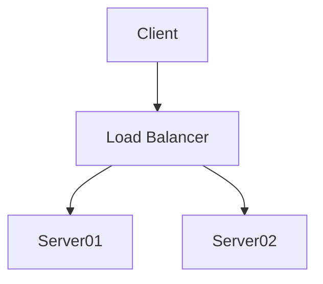

## ATLAS Framework Architecture

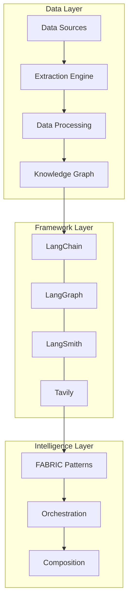

## Sequence Diagram

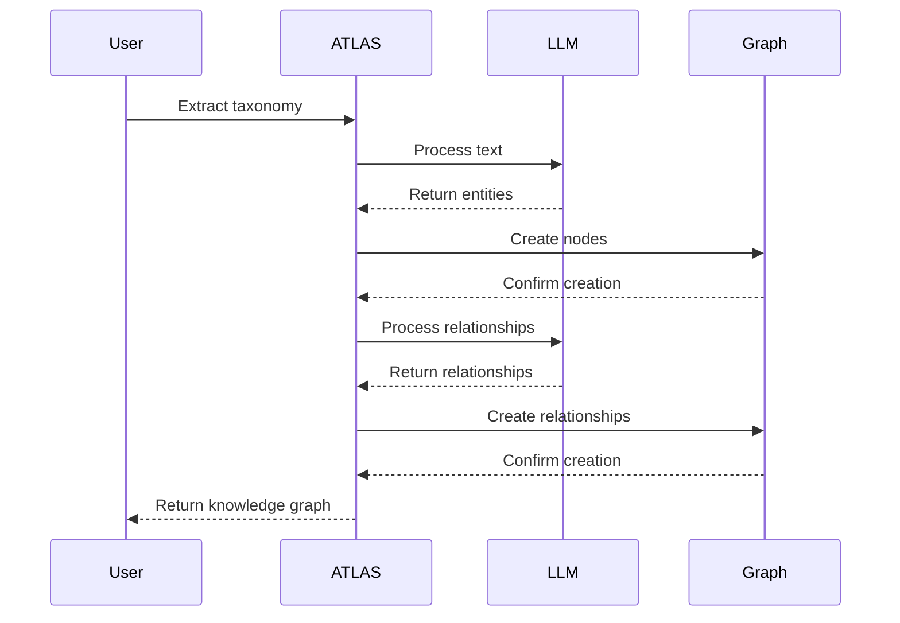

## Class Diagram

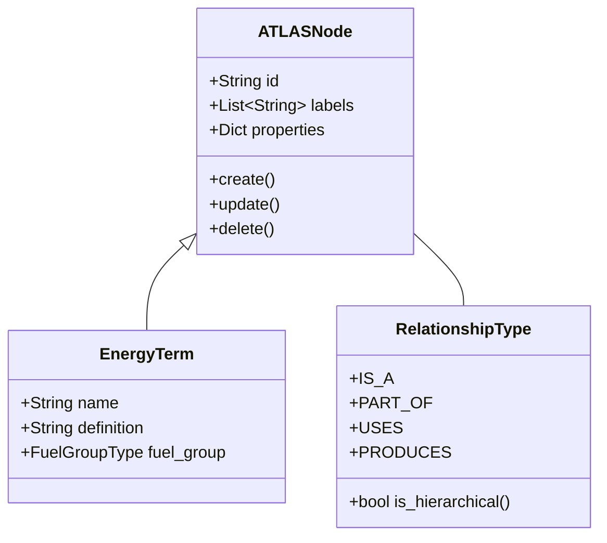

## Entity Relationship Diagram

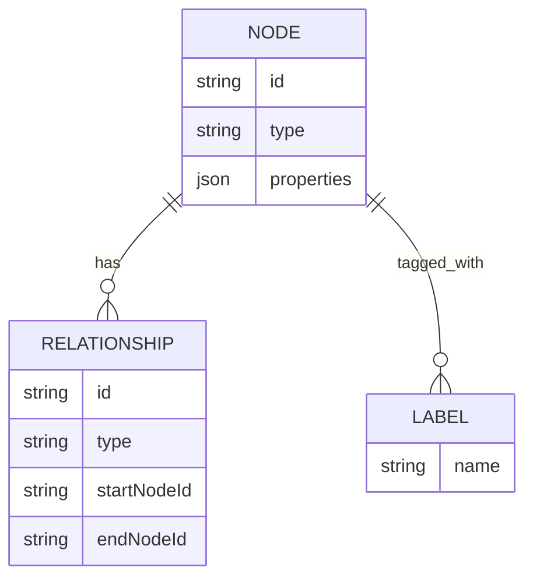

## State Diagram

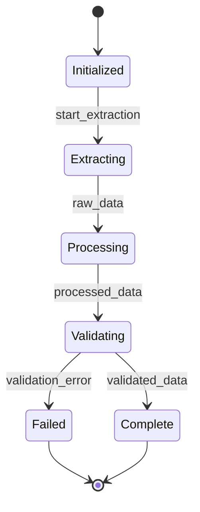

## Gantt Chart

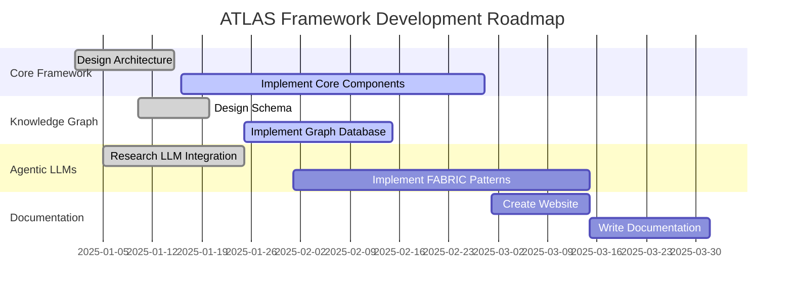

## Pie Chart

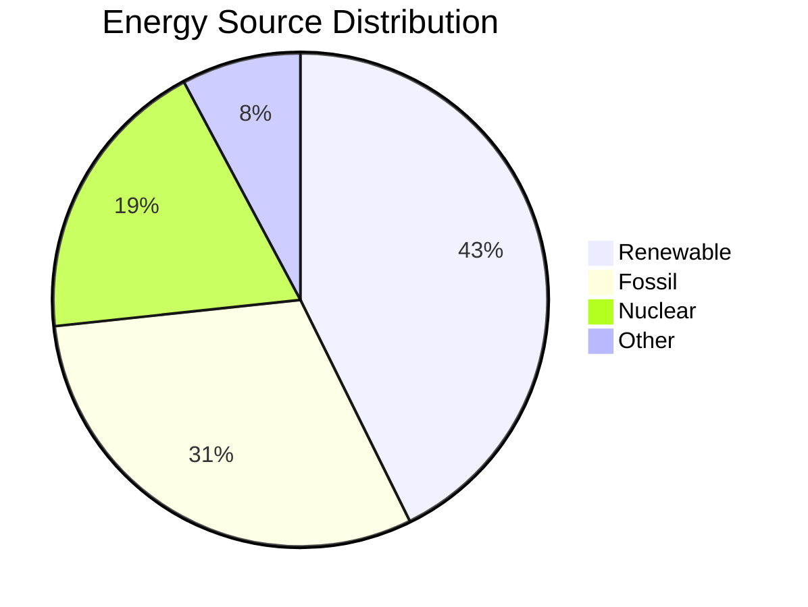

## User Journey

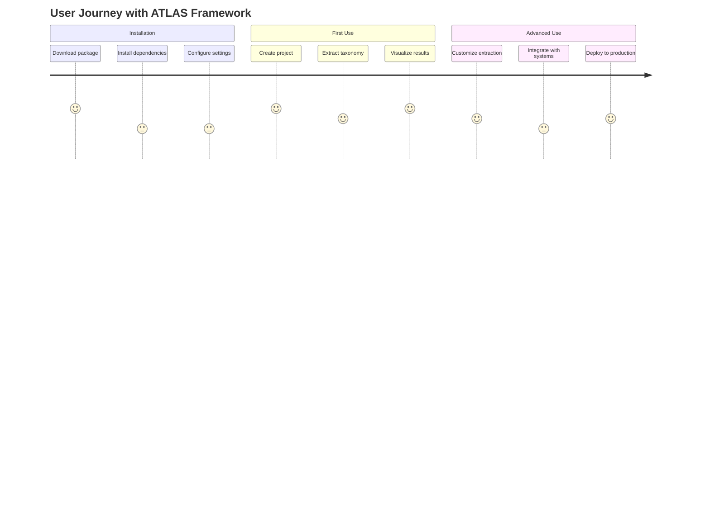

## Git Graph

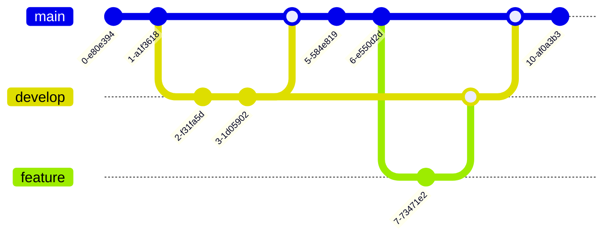

## Requirement Diagram

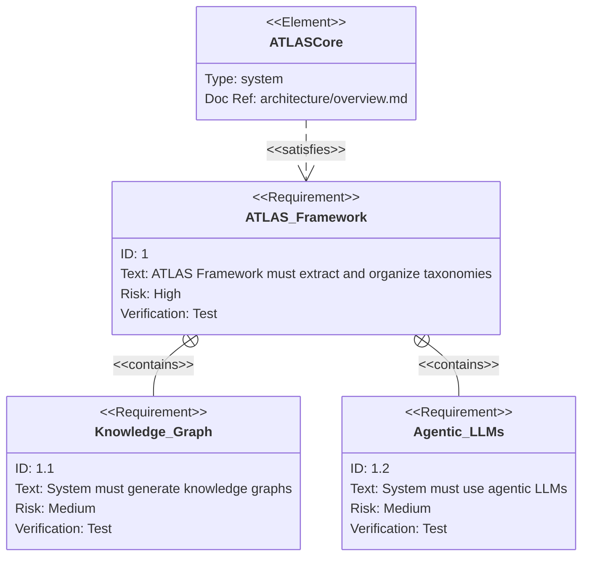

## C4 Diagram

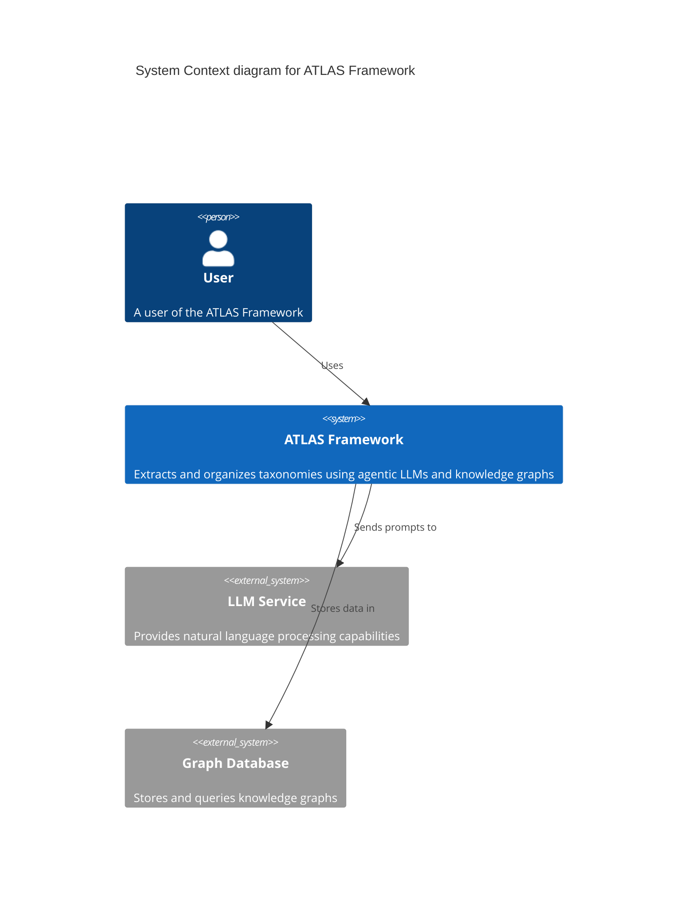

## Mindmap

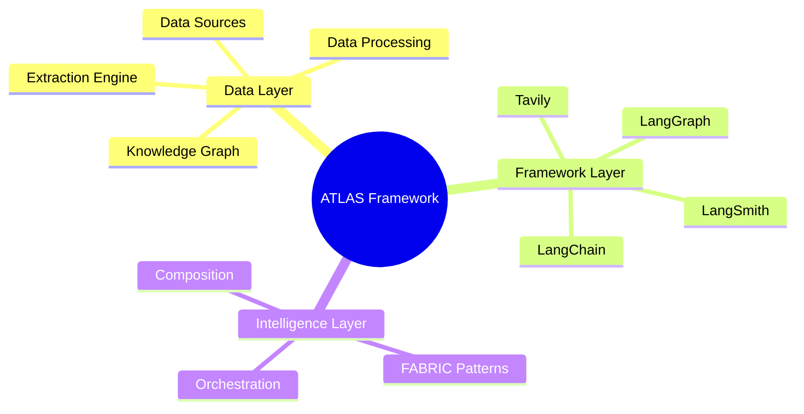

## Timeline

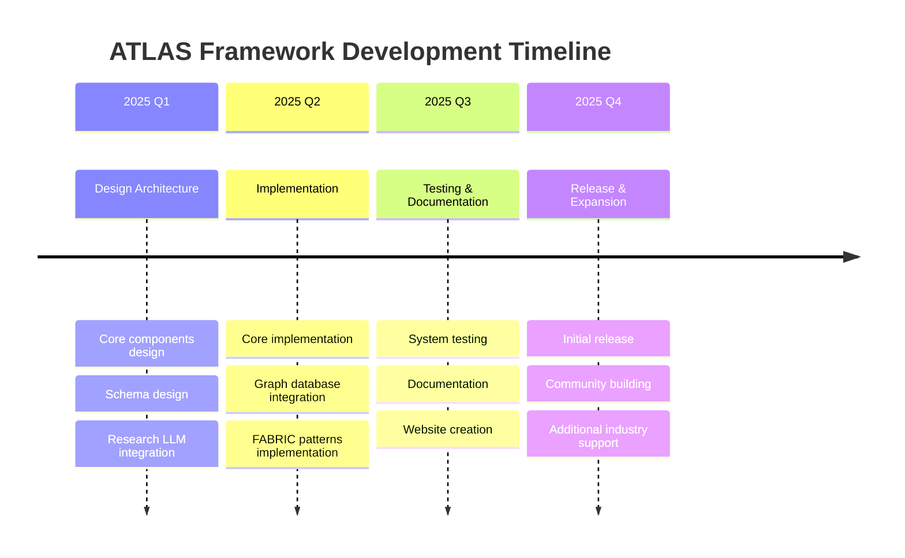

## Quadrant Chart

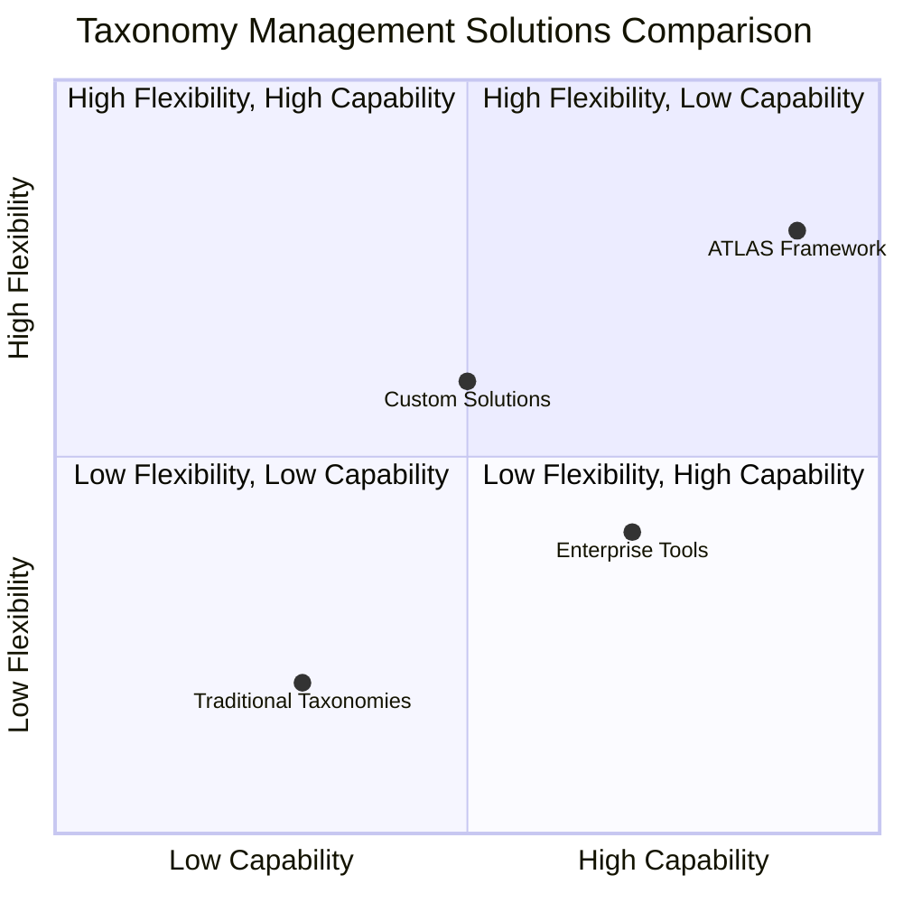

## XY Chart

```mermaid
xychart-beta
    title "ATLAS Framework Performance"
    x-axis "Number of Terms" [100, 500, 1000, 5000, 10000]
    y-axis "Processing Time (s)" [0, 10, 20, 30, 40, 50]
    line [5, 12, 18, 25, 30]
    line [8, 15, 25, 35, 45]
```

## Block Diagram

```mermaid
block-beta
    columns 3
    
    block:app["ATLAS Framework"]
    block:data["Data Sources"]
    block:llm["LLM Services"]
    block:graph["Graph Database"]
    block:ui["User Interface"]
    
    data --> app
    app --> llm
    llm --> app
    app --> graph
    graph --> app
    app --> ui
```

These examples demonstrate the power and flexibility of Mermaid.js for creating various types of diagrams in the ATLAS Framework documentation.

