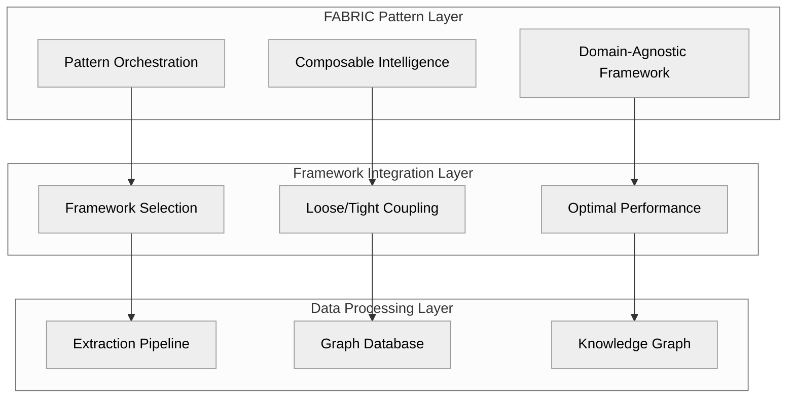
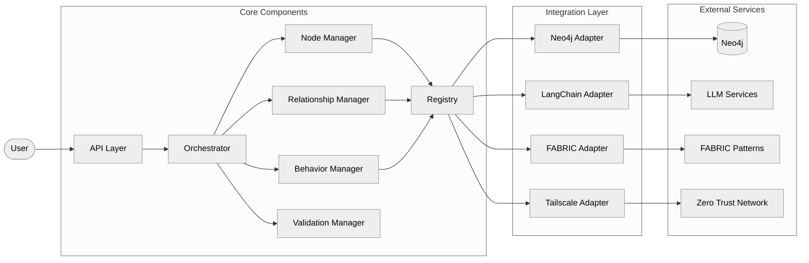
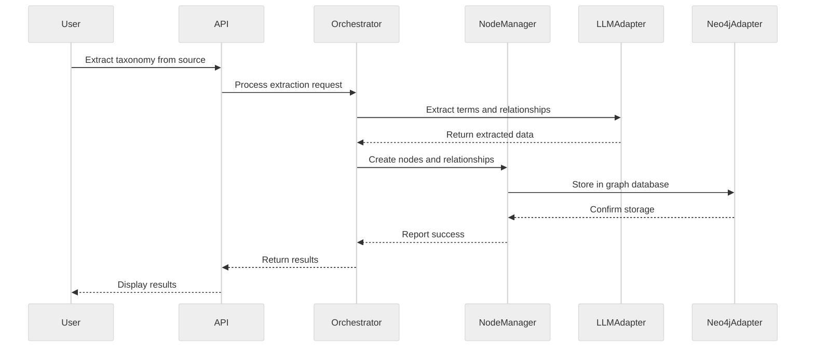

# Architecture Overview

The ATLAS Framework is built on a revolutionary architecture that combines the power of agentic LLMs, graph databases, and flexible framework integration. This page provides a high-level overview of the architecture and its key components.

## Three-Layer Architecture

ATLAS Framework is organized into three primary layers, each with distinct responsibilities:



### 1. Data Processing Layer

The foundation of ATLAS Framework, responsible for data extraction, storage, and knowledge graph generation:

- **Extraction Pipeline**: Processes raw data sources to extract taxonomy terms and relationships
- **Graph Database**: Stores and manages the extracted knowledge in a Neo4j graph database
- **Knowledge Graph**: Represents the interconnected knowledge with nodes, relationships, and properties

### 2. Framework Integration Layer

The middle layer that provides flexible integration with various AI frameworks:

- **Framework Selection**: Dynamically selects the optimal framework for each task
- **Loose/Tight Coupling**: Maintains loose coupling between components but tight coupling within frameworks
- **Optimal Performance**: Ensures maximum performance through framework-specific optimizations

### 3. FABRIC Pattern Layer

The top layer that orchestrates intelligent behavior through composable patterns:

- **Pattern Orchestration**: Coordinates the execution of FABRIC patterns
- **Composable Intelligence**: Combines patterns to solve complex problems
- **Domain-Agnostic Framework**: Provides a consistent interface across different domains

## Core Components

The ATLAS Framework consists of several core components that work together to provide a comprehensive solution:



### API Layer

The entry point for users and applications to interact with ATLAS Framework:

- **REST API**: HTTP endpoints for CRUD operations and advanced queries
- **GraphQL API**: Flexible querying of the knowledge graph
- **CLI**: Command-line interface for automation and scripting
- **Python SDK**: Native Python interface for programmatic access

### Core Components

The central components that implement the core functionality:

- **Orchestrator**: Coordinates the execution of operations across components
- **Node Manager**: Creates, updates, and manages taxonomy nodes
- **Relationship Manager**: Manages relationships between nodes
- **Behavior Manager**: Applies behaviors to nodes and relationships
- **Validation Manager**: Validates nodes and relationships against rules
- **Registry**: Central repository for node types, behaviors, and configurations

### Integration Layer

Adapters that connect ATLAS Framework to external services:

- **Neo4j Adapter**: Connects to Neo4j graph database
- **LangChain Adapter**: Integrates with LangChain for LLM operations
- **FABRIC Adapter**: Implements FABRIC patterns for intelligent behavior
- **Tailscale Adapter**: Provides secure networking through Tailscale VPN

### External Services

Third-party services that ATLAS Framework integrates with:

- **Neo4j**: Graph database for storing and querying the knowledge graph
- **LLM Services**: OpenAI, Anthropic, and other LLM providers
- **FABRIC Patterns**: Repository of intelligent patterns
- **Zero Trust Network**: Secure networking through Tailscale

## Data Flow

The following diagram illustrates the data flow through the ATLAS Framework:



1. User initiates an extraction request through the API
2. Orchestrator coordinates the extraction process
3. LLM Adapter uses agentic LLMs to extract terms and relationships
4. Node Manager creates nodes and relationships from the extracted data
5. Neo4j Adapter stores the data in the graph database
6. Results are returned to the user

## Key Design Principles

The ATLAS Framework is built on several key design principles:

### 1. Composition over Inheritance

ATLAS uses composition over inheritance to promote code reuse and flexibility:

```python
# Instead of inheritance-based approach
class EnergyTerm(BaseTerm):
    def __init__(self, name, definition, fuel_group):
        super().__init__(name, definition)
        self.fuel_group = fuel_group

# ATLAS uses composition
node = ATLASNode(
    node_type="energy_term",
    properties={
        "name": "Solar PV",
        "definition": "Photovoltaic technology",
        "fuel_group": "renewable"
    },
    behaviors=[
        ValidationBehavior(),
        RelationshipDiscoveryBehavior()
    ]
)
```

### 2. Configuration-Driven Design

ATLAS uses configuration to define node types, behaviors, and relationships:

```json
{
  "node_types": {
    "energy_term": {
      "labels": ["EnergyTerm", "TaxonomyNode"],
      "properties": {
        "name": {"type": "string", "required": true},
        "definition": {"type": "string", "required": true},
        "fuel_group": {"type": "string", "required": true}
      },
      "behaviors": ["validation", "relationship_discovery"]
    }
  }
}
```

### 3. Loose/Tight Coupling Hybrid

ATLAS uses a hybrid approach to coupling:

- **Loose Coupling** between major components for flexibility
- **Tight Coupling** within frameworks for performance

```python
# Loose coupling between components
class TaxonomySystem:
    def __init__(self, framework_preference: FrameworkType):
        self.data_pipeline = DataPipelineOrchestrator()  # Loose
        self.agent_coordinator = AgentCoordinator()      # Loose
        self.framework_binder = self.select_framework(framework_preference)  # Tight

# Tight coupling within selected framework
def select_framework(self, preference: FrameworkType) -> FrameworkBinder:
    if preference == FrameworkType.LANGCHAIN:
        from langchain_openai import ChatOpenAI
        from langchain_community.graphs import Neo4jGraph
        return LangChainFrameworkBinder(ChatOpenAI(), Neo4jGraph())
```

### 4. Type Safety with Pydantic v2

ATLAS uses Pydantic v2 for comprehensive validation and type safety:

```python
from pydantic import BaseModel, Field, field_validator

class EnergyTermData(BaseModel):
    name: str = Field(..., description="Name of the energy term")
    definition: str = Field(..., description="Definition of the energy term")
    fuel_group: str = Field(..., description="Fuel group classification")
    
    @field_validator("fuel_group")
    def validate_fuel_group(cls, v):
        valid_groups = ["renewable", "fossil", "nuclear", "alternative"]
        if v not in valid_groups:
            raise ValueError(f"Fuel group must be one of: {', '.join(valid_groups)}")
        return v
```

### 5. Rich Enums with @property Methods

ATLAS uses rich enums with @property methods for business logic:

```python
from enum import Enum

class FuelGroupType(str, Enum):
    RENEWABLE = "renewable"
    FOSSIL = "fossil"
    NUCLEAR = "nuclear"
    ALTERNATIVE = "alternative"
    
    @property
    def is_clean_energy(self) -> bool:
        return self in [FuelGroupType.RENEWABLE, FuelGroupType.NUCLEAR]
    
    @property
    def carbon_intensity(self) -> float:
        intensities = {
            FuelGroupType.RENEWABLE: 0.0,
            FuelGroupType.NUCLEAR: 0.0,
            FuelGroupType.ALTERNATIVE: 0.5,
            FuelGroupType.FOSSIL: 1.0
        }
        return intensities[self]
```

## Next Steps

Now that you understand the high-level architecture of ATLAS Framework, you can explore:

- [Design Principles](design-principles.md) for more details on the architectural decisions
- [Core Components](core-components.md) for in-depth information on each component
- [Data Models](data-models.md) to understand how data is structured
- [Enums & Properties](enums-properties.md) to learn about the type-safe enum system

