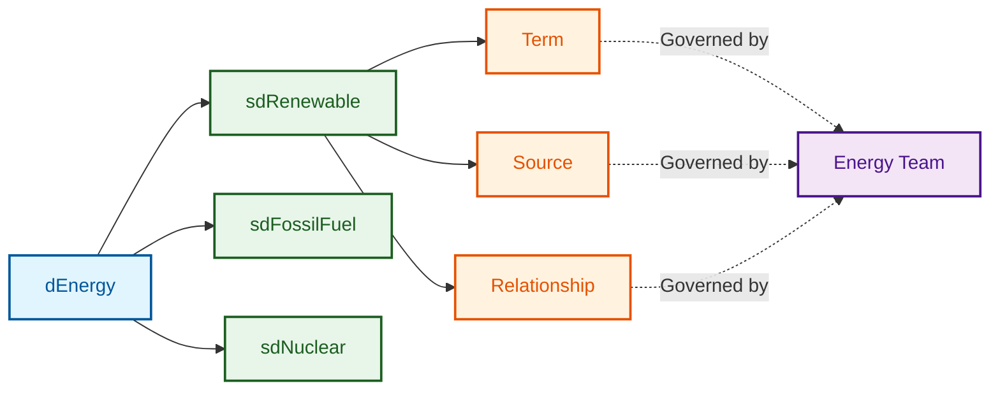
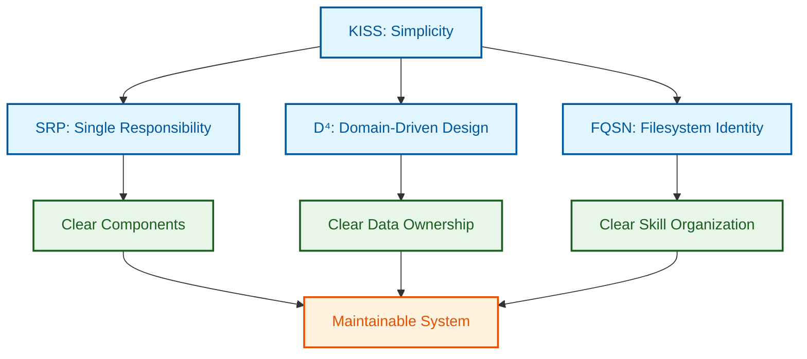

# Architectural Principles

## Non-Negotiable Principles

The ATLAS Framework is built on four foundational principles that guide every design decision. These principles are non-negotiable and must be adhered to throughout the system.

---

## KISS: Keep It Simple and Standard

### Definition

**KISS** stands for "Keep It Simple and Standard" (not "Keep It Simple, Stupid"). This principle prioritizes simplicity and adherence to established standards over clever complexity.

### Core Tenets

The KISS principle is applied through several core tenets:

**One Configuration File Per Concern**: Use `pyproject.toml` for Python configuration, not multiple config formats. Each concern gets its own standard configuration file.

**Standard Python Package Structure**: Follow the `src` layout pattern. Use standard Python packaging conventions throughout.

**Standard Environment Variables**: Use the `ATLAS_*` prefix for all environment variables. Follow the twelve-factor app methodology.

**Standard File Formats**: Use JSON for data interchange, Markdown for documentation, YAML only for environment specifications.

### Application Examples

=== "Configuration"

    ```toml
    # pyproject.toml - ONE file for Python configuration
    [project]
    name = "atlas-framework"
    version = "1.0.0"
    requires-python = ">=3.11"
    
    [tool.uv]
    dev-dependencies = ["pytest>=7.4.0"]
    
    [tool.ruff]
    line-length = 100
    ```

=== "Environment Variables"

    ```bash
    # Standard ATLAS_* prefix
    ATLAS_NEO4J_URI=bolt://localhost:7687
    ATLAS_NEO4J_USER=neo4j
    ATLAS_NEO4J_PASSWORD=password
    ATLAS_LANGSMITH_API_KEY=your-key
    ```

=== "File Formats"

    ```
    config/           # JSON for configuration data
    docs/             # Markdown for documentation
    environments/     # YAML only for Conda environments
    data/             # JSON for data interchange
    ```

### Benefits

Adhering to KISS provides several key benefits:

**Reduced Cognitive Load**: Developers can focus on business logic rather than understanding complex abstractions.

**Easier Onboarding**: New team members can quickly understand the system structure.

**Better Maintainability**: Standard approaches are well-documented and widely understood.

**Fewer Bugs**: Simple code has fewer places for bugs to hide.

---

## SRP: Single Responsibility Principle

### Definition

**SRP** states that each module, class, function, and skill should have ONE clearly defined responsibility. A component should have only one reason to change.

### Application Levels

SRP is applied at multiple levels throughout ATLAS:

#### Skill Level

Each `SKILL.md` defines ONE specific capability. For example, `energy.extraction.eia_glossary` extracts EIA glossary data - nothing more.

#### Module Level

Each Python module handles ONE domain concern. The `src/atlas/integrations/langchain/` module handles only LangChain integration.

#### Function Level

Each function performs ONE transformation or operation. Extract, transform, load - each gets its own function.

#### Database Level

Each database schema represents ONE business domain. `dEnergy` contains only energy-related data.

### Code Examples

=== "Good SRP"

    ```python
    class EIAGlossaryExtractor:
        """Single responsibility: Extract glossary from EIA website"""
        
        def extract(self, url: str) -> List[Term]:
            """Extract terms from EIA glossary page"""
            html = self._fetch_html(url)
            return self._parse_terms(html)
    
    class TermValidator:
        """Single responsibility: Validate extracted terms"""
        
        def validate(self, terms: List[Term]) -> ValidationResult:
            """Validate term structure and content"""
            return self._check_required_fields(terms)
    ```

=== "Bad SRP"

    ```python
    class EIAProcessor:
        """Multiple responsibilities - AVOID THIS"""
        
        def process(self, url: str) -> None:
            # Extraction
            html = self._fetch_html(url)
            terms = self._parse_terms(html)
            
            # Validation
            valid_terms = self._validate_terms(terms)
            
            # Storage
            self._save_to_database(valid_terms)
            
            # Notification
            self._send_email_notification()
    ```

### Benefits

Following SRP provides several advantages:

**Clear Responsibilities**: Each component's purpose is immediately obvious.

**Easier Testing**: Components with single responsibilities are easier to unit test.

**Better Reusability**: Single-purpose components can be reused in different contexts.

**Simplified Maintenance**: Changes to one responsibility don't affect others.

---

## D⁴: Domain-Driven Database Design

### Definition

**D⁴** (Domain-Driven Database Design) uses Fully Qualified Domain Names (FQDNs) for database schemas, with business definitions stored as queryable metadata rather than comments.

### Schema Naming Convention

D⁴ uses a hierarchical naming convention:

**Domain Level**: Prefix with `d` - `dEnergy`, `dTransportation`, `dManufacturing`

**Sub-Domain Level**: Prefix with `sd` - `sdRenewable`, `sdFossilFuel`, `sdNuclear`

**Entity Level**: Use business terms - `Term`, `Relationship`, `Source`

### Business Definitions as Metadata

Business definitions are stored as queryable metadata, not comments:

```cypher
// Create domain metadata
CREATE (d:DomainMetadata {
    fqdn: 'dEnergy.sdRenewable.Term',
    businessDefinition: 'A renewable energy term from authoritative sources',
    dataGovernor: 'energy-team@company.com',
    updateFrequency: 'quarterly',
    dataClassification: 'public'
})
```

### Temporal Metadata with Allen Intervals

D⁴ uses Allen Intervals for temporal metadata, specifically the "meets" relationship:

```cypher
CREATE (t:Term {
    name: 'Solar PV',
    definition: 'Photovoltaic technology...',
    startDateTime: datetime('2024-01-01T00:00:00Z'),
    endDateTime: null  // Open-ended, current version
})
```

When a term is updated, the old version is closed and a new version is created:

```cypher
// Close old version
MATCH (old:Term {name: 'Solar PV', endDateTime: null})
SET old.endDateTime = datetime('2024-06-01T00:00:00Z')

// Create new version that "meets" the old version
CREATE (new:Term {
    name: 'Solar PV',
    definition: 'Updated definition...',
    startDateTime: datetime('2024-06-01T00:00:00Z'),
    endDateTime: null
})
```

### FQDN Governance

FQDNs carry governance information with them:



### Benefits

D⁴ provides several key advantages:

**Automatic Lineage**: FQDN structure enables automatic data lineage tracing.

**Clear Governance**: Each domain has a clear data governor.

**Queryable Metadata**: Business definitions can be queried like data.

**Temporal Tracking**: Allen Intervals provide precise temporal semantics.

---

## FQSN: Fully Qualified Skill Name

### Definition

**FQSN** (Fully Qualified Skill Name) uses the filesystem path as the skill identifier. No separate naming registry is needed - the path determines the identity.

### Path-to-Name Mapping

The filesystem structure directly maps to skill names:

```
skills/energy/extraction/eia_glossary/SKILL.md
    ↓
energy.extraction.eia_glossary
```

### Filesystem Structure

```
skills/
├── energy/
│   ├── extraction/
│   │   ├── eia_glossary/
│   │   │   ├── SKILL.md
│   │   │   ├── prompts/
│   │   │   └── tests/
│   │   └── iea_data/
│   │       └── SKILL.md
│   ├── analysis/
│   │   └── relationship_discovery/
│   │       └── SKILL.md
│   └── synthesis/
│       └── knowledge_graph/
│           └── SKILL.md
└── transportation/
    └── ...
```

### Lazy Loading Mechanism

Skills are discovered and loaded on-demand based on filesystem traversal:

```python
class SkillsRegistry:
    """Single responsibility: Skill discovery and loading"""
    
    def __init__(self, skills_root: Path) -> None:
        self.skills_root = skills_root
        self._cache: Dict[str, Skill] = {}
    
    def get_skill(self, fqsn: str) -> Skill:
        """Get skill by FQSN, loading if necessary"""
        if fqsn not in self._cache:
            skill_path = self._fqsn_to_path(fqsn)
            self._cache[fqsn] = self._load_skill(skill_path)
        return self._cache[fqsn]
    
    def _fqsn_to_path(self, fqsn: str) -> Path:
        """Convert FQSN to filesystem path"""
        parts = fqsn.split('.')
        return self.skills_root / '/'.join(parts) / 'SKILL.md'
```

### Benefits

FQSN provides several advantages:

**No Duplication**: Path and name are the same thing - DRY principle.

**Automatic Discovery**: Skills are discovered by filesystem traversal.

**Clear Organization**: Hierarchical structure reflects skill relationships.

**Lazy Loading**: Skills are loaded only when needed, reducing memory usage.

---

## Principle Interactions

The four principles work together synergistically:



### KISS + SRP

KISS ensures each component is simple. SRP ensures each component has one responsibility. Together, they create components that are both simple and focused.

### SRP + D⁴

SRP ensures each database schema has one domain. D⁴ ensures that domain is clearly identified and governed.

### KISS + FQSN

KISS avoids complex naming registries. FQSN uses the filesystem as the registry - the simplest possible approach.

### D⁴ + FQSN

D⁴ uses FQDNs for database schemas. FQSN uses filesystem paths for skills. Both avoid separate registries and use natural hierarchies.

---

## Principle Enforcement

These principles are enforced through multiple mechanisms:

### Code Review

All code changes are reviewed against the four principles. Violations are identified and corrected before merge.

### Automated Testing

Tests verify that components follow SRP. Each component should have tests for its single responsibility only.

### Linting and Formatting

Ruff enforces code style that supports KISS. Complex code triggers warnings.

### Documentation

All components must document their single responsibility. SKILL.md files must clearly state what the skill does.

---

## Next Steps

<div class="grid cards" markdown>

-   :material-cog-outline:{ .lg .middle } **System Design**

    ---

    See how these principles are applied in the system architecture

    [:octicons-arrow-right-24: System design](system-design.md)

-   :material-file-tree-outline:{ .lg .middle } **Repository Structure**

    ---

    Explore how the repository structure reflects these principles

    [:octicons-arrow-right-24: Repository](repository-structure.md)

-   :material-database-outline:{ .lg .middle } **D⁴ Database Design**

    ---

    Deep dive into domain-driven database design

    [:octicons-arrow-right-24: Database design](d4-database-design.md)

</div>
