# 🏗️ ATLAS Framework - True DRY Architecture with Composition

## 🎯 **Addressing the DRY Violation**

You are absolutely correct! The inheritance pattern `class MyEnergyNode(EnergyGraphNode)` violates DRY principles by forcing code duplication for every new node type. Here's the corrected architecture using composition and generic patterns.

## 📊 **Architecture Overview**


## 🔧 **True DRY Implementation**

### 1. **Generic Node with Composition Pattern**

```python
"""
Generic ATLAS node with composition-based extensions.
Eliminates the need for inheritance-based node creation.
"""

from typing import TypeVar, Generic, Dict, Any, List, Optional, Union, Callable, Type
from pydantic import BaseModel, Field, field_validator
from atlas.descriptors import CachedProperty
from atlas.decorators import atlas_operation
from atlas.enums import NodeLabelType, RelationshipType
from datetime import datetime
import uuid

T = TypeVar('T', bound=BaseModel)

class NodeBehavior(BaseModel):
    """
    Base class for node behaviors that can be composed.
    
    This eliminates the need for inheritance-based node creation
    by providing composable behaviors.
    """
    
    behavior_id: str = Field(..., description="Unique behavior identifier")
    behavior_type: str = Field(..., description="Type of behavior")
    priority: int = Field(default=100, description="Execution priority (lower = higher priority)")
    enabled: bool = Field(default=True, description="Whether behavior is enabled")
    
    async def execute(self, node: 'ATLASNode', context: Dict[str, Any]) -> Any:
        """
        Execute the behavior on a node.
        
        Args:
            node: The ATLAS node to operate on
            context: Execution context and parameters
            
        Returns:
            Any: Result of the behavior execution
        """
        raise NotImplementedError("Subclasses must implement execute method")

class ComputationBehavior(NodeBehavior):
    """
    Behavior for expensive computations with caching.
    
    Provides DRY implementation of cached computations that can be
    applied to any node type without inheritance.
    """
    
    computation_function: str = Field(..., description="Name of computation function")
    cache_ttl: Optional[float] = Field(default=300, description="Cache TTL in seconds")
    dependencies: List[str] = Field(default_factory=list, description="Computation dependencies")
    
    async def execute(self, node: 'ATLASNode', context: Dict[str, Any]) -> Any:
        """
        Execute cached computation.
        
        Args:
            node: Target node for computation
            context: Computation context and parameters
            
        Returns:
            Any: Computation result (cached if available)
        """
        cache_key = f"{self.computation_function}_{node.node_id}"
        
        # Check cache first
        if hasattr(node, '_computation_cache') and cache_key in node._computation_cache:
            cached_result, timestamp = node._computation_cache[cache_key]
            if self.cache_ttl is None or (datetime.utcnow().timestamp() - timestamp) < self.cache_ttl:
                return cached_result
        
        # Execute computation
        computation_func = getattr(node, self.computation_function, None)
        if not computation_func:
            raise ValueError(f"Computation function {self.computation_function} not found on node")
        
        result = await computation_func(context)
        
        # Cache result
        if not hasattr(node, '_computation_cache'):
            node._computation_cache = {}
        node._computation_cache[cache_key] = (result, datetime.utcnow().timestamp())
        
        return result

class AnalysisBehavior(NodeBehavior):
    """
    Behavior for relationship analysis with retry logic.
    
    Provides DRY implementation of analysis operations that can be
    applied to any node type without code duplication.
    """
    
    analysis_type: str = Field(..., description="Type of analysis to perform")
    retry_attempts: int = Field(default=3, description="Number of retry attempts")
    timeout_seconds: float = Field(default=30.0, description="Analysis timeout")
    
    async def execute(self, node: 'ATLASNode', context: Dict[str, Any]) -> Dict[str, Any]:
        """
        Execute analysis with retry logic.
        
        Args:
            node: Target node for analysis
            context: Analysis context and parameters
            
        Returns:
            Dict[str, Any]: Analysis results
        """
        analysis_func = getattr(node, f"_perform_{self.analysis_type}_analysis", None)
        if not analysis_func:
            raise ValueError(f"Analysis function for {self.analysis_type} not found")
        
        # Apply retry logic
        for attempt in range(self.retry_attempts):
            try:
                result = await analysis_func(context)
                return {
                    "analysis_type": self.analysis_type,
                    "result": result,
                    "attempt": attempt + 1,
                    "success": True
                }
            except Exception as e:
                if attempt == self.retry_attempts - 1:
                    return {
                        "analysis_type": self.analysis_type,
                        "error": str(e),
                        "attempt": attempt + 1,
                        "success": False
                    }
                await asyncio.sleep(2 ** attempt)  # Exponential backoff

class ATLASNode(BaseModel, Generic[T]):
    """
    Generic ATLAS node using composition instead of inheritance.
    
    This design eliminates the need for creating custom node classes,
    following true DRY principles by composing behaviors instead.
    """
    
    # Core node properties
    node_id: str = Field(
        default_factory=lambda: str(uuid.uuid4()),
        description="Unique node identifier"
    )
    labels: List[NodeLabelType] = Field(
        ...,
        min_items=1,
        description="Node labels defining the node type"
    )
    properties: Dict[str, Any] = Field(
        default_factory=dict,
        description="Node properties and metadata"
    )
    
    # Composition-based behaviors
    behaviors: List[NodeBehavior] = Field(
        default_factory=list,
        description="Composable behaviors attached to this node"
    )
    
    # Domain-specific data
    domain_data: Optional[T] = Field(
        None,
        description="Domain-specific structured data"
    )
    
    # Timestamps
    created_at: datetime = Field(default_factory=datetime.utcnow)
    updated_at: datetime = Field(default_factory=datetime.utcnow)
    
    def add_behavior(self, behavior: NodeBehavior) -> None:
        """
        Add a behavior to this node.
        
        Args:
            behavior: The behavior to add to this node
        """
        # Remove existing behavior of same type if present
        self.behaviors = [b for b in self.behaviors if b.behavior_type != behavior.behavior_type]
        self.behaviors.append(behavior)
        self.behaviors.sort(key=lambda b: b.priority)
        self.updated_at = datetime.utcnow()
    
    def remove_behavior(self, behavior_type: str) -> bool:
        """
        Remove a behavior from this node.
        
        Args:
            behavior_type: Type of behavior to remove
            
        Returns:
            bool: True if behavior was removed, False if not found
        """
        original_count = len(self.behaviors)
        self.behaviors = [b for b in self.behaviors if b.behavior_type != behavior_type]
        
        if len(self.behaviors) < original_count:
            self.updated_at = datetime.utcnow()
            return True
        return False
    
    async def execute_behavior(self, behavior_type: str, context: Dict[str, Any]) -> Any:
        """
        Execute a specific behavior on this node.
        
        Args:
            behavior_type: Type of behavior to execute
            context: Execution context and parameters
            
        Returns:
            Any: Result of behavior execution
            
        Raises:
            ValueError: If behavior type is not found
        """
        for behavior in self.behaviors:
            if behavior.behavior_type == behavior_type and behavior.enabled:
                return await behavior.execute(self, context)
        
        raise ValueError(f"Behavior type '{behavior_type}' not found or disabled")
    
    async def execute_all_behaviors(self, context: Dict[str, Any]) -> Dict[str, Any]:
        """
        Execute all enabled behaviors on this node.
        
        Args:
            context: Execution context and parameters
            
        Returns:
            Dict[str, Any]: Results from all behavior executions
        """
        results = {}
        
        for behavior in sorted(self.behaviors, key=lambda b: b.priority):
            if behavior.enabled:
                try:
                    result = await behavior.execute(self, context)
                    results[behavior.behavior_type] = {
                        "success": True,
                        "result": result
                    }
                except Exception as e:
                    results[behavior.behavior_type] = {
                        "success": False,
                        "error": str(e)
                    }
        
        return results

class NodeFactory:
    """
    Factory for creating nodes with pre-configured behaviors.
    
    This eliminates the need for inheritance-based node creation
    by providing a configuration-driven approach.
    """
    
    def __init__(self):
        """Initialize the node factory with behavior registries."""
        self._behavior_templates: Dict[str, Dict[str, Any]] = {}
        self._node_type_configs: Dict[str, Dict[str, Any]] = {}
    
    def register_node_type(
        self, 
        node_type: str, 
        config: Dict[str, Any]
    ) -> None:
        """
        Register a new node type configuration.
        
        Args:
            node_type: Unique identifier for the node type
            config: Configuration dictionary for the node type
        """
        self._node_type_configs[node_type] = config
    
    def register_behavior_template(
        self, 
        template_name: str, 
        template_config: Dict[str, Any]
    ) -> None:
        """
        Register a behavior template for reuse.
        
        Args:
            template_name: Unique identifier for the template
            template_config: Template configuration dictionary
        """
        self._behavior_templates[template_name] = template_config
    
    def create_node(
        self, 
        node_type: str, 
        domain_data: Optional[BaseModel] = None,
        additional_behaviors: Optional[List[NodeBehavior]] = None
    ) -> ATLASNode:
        """
        Create a node of the specified type with pre-configured behaviors.
        
        Args:
            node_type: Type of node to create
            domain_data: Domain-specific data for the node
            additional_behaviors: Additional behaviors to attach
            
        Returns:
            ATLASNode: Configured node instance
            
        Raises:
            ValueError: If node type is not registered
        """
        if node_type not in self._node_type_configs:
            raise ValueError(f"Node type '{node_type}' not registered")
        
        config = self._node_type_configs[node_type]
        
        # Create base node
        node = ATLASNode(
            labels=[NodeLabelType(label) for label in config.get('labels', [])],
            properties=config.get('default_properties', {}),
            domain_data=domain_data
        )
        
        # Add configured behaviors
        for behavior_config in config.get('behaviors', []):
            behavior = self._create_behavior_from_config(behavior_config)
            node.add_behavior(behavior)
        
        # Add additional behaviors if provided
        if additional_behaviors:
            for behavior in additional_behaviors:
                node.add_behavior(behavior)
        
        return node
    
    def _create_behavior_from_config(self, config: Dict[str, Any]) -> NodeBehavior:
        """
        Create a behavior instance from configuration.
        
        Args:
            config: Behavior configuration dictionary
            
        Returns:
            NodeBehavior: Configured behavior instance
        """
        behavior_type = config.get('type')
        
        if behavior_type == 'computation':
            return ComputationBehavior(**config)
        elif behavior_type == 'analysis':
            return AnalysisBehavior(**config)
        else:
            raise ValueError(f"Unknown behavior type: {behavior_type}")
```

### 2. **Configuration-Driven Node Creation**

```python
"""
Configuration-driven node creation eliminating inheritance patterns.
"""

# Node type configurations (stored in JSON/YAML)
NODE_TYPE_CONFIGURATIONS = {
    "energy_term": {
        "labels": ["EnergyTerm", "TaxonomyNode"],
        "default_properties": {
            "fuel_group": None,
            "extraction_confidence": 0.8
        },
        "behaviors": [
            {
                "type": "computation",
                "behavior_id": "relationship_analysis",
                "behavior_type": "computation",
                "computation_function": "_compute_relationship_metrics",
                "cache_ttl": 300,
                "priority": 100
            },
            {
                "type": "analysis", 
                "behavior_id": "semantic_analysis",
                "behavior_type": "analysis",
                "analysis_type": "semantic_similarity",
                "retry_attempts": 3,
                "timeout_seconds": 30.0,
                "priority": 200
            }
        ]
    },
    "renewable_source": {
        "labels": ["RenewableSource", "EnergyTerm"],
        "default_properties": {
            "fuel_group": "renewable",
            "carbon_intensity": "low"
        },
        "behaviors": [
            {
                "type": "computation",
                "behavior_id": "efficiency_analysis",
                "behavior_type": "computation", 
                "computation_function": "_compute_efficiency_metrics",
                "cache_ttl": 600,
                "priority": 50
            }
        ]
    }
}

class ConfigurationManager:
    """
    Manages node type configurations and behavior templates.
    
    Provides centralized configuration management for DRY node creation.
    """
    
    def __init__(self, config_data: Dict[str, Any]):
        """
        Initialize configuration manager.
        
        Args:
            config_data: Configuration data dictionary
        """
        self.config_data = config_data
        self.node_factory = NodeFactory()
        self._register_configurations()
    
    def _register_configurations(self) -> None:
        """Register all node type configurations with the factory."""
        for node_type, config in self.config_data.items():
            self.node_factory.register_node_type(node_type, config)
    
    def create_energy_term(
        self, 
        term_name: str, 
        definition: str, 
        fuel_group: str
    ) -> ATLASNode:
        """
        Create an energy term node using configuration.
        
        Args:
            term_name: Name of the energy term
            definition: Definition of the term
            fuel_group: Fuel group classification
            
        Returns:
            ATLASNode: Configured energy term node
        """
        from atlas.models.domain.energy import EnergyTermData
        
        domain_data = EnergyTermData(
            term_name=term_name,
            definition=definition,
            fuel_group=fuel_group,
            category="energy_term"
        )
        
        return self.node_factory.create_node("energy_term", domain_data)
    
    def create_renewable_source(
        self, 
        source_name: str, 
        technology_type: str,
        efficiency_rating: float
    ) -> ATLASNode:
        """
        Create a renewable source node using configuration.
        
        Args:
            source_name: Name of the renewable source
            technology_type: Type of renewable technology
            efficiency_rating: Efficiency rating (0.0 to 1.0)
            
        Returns:
            ATLASNode: Configured renewable source node
        """
        from atlas.models.domain.energy import RenewableSourceData
        
        domain_data = RenewableSourceData(
            source_name=source_name,
            technology_type=technology_type,
            efficiency_rating=efficiency_rating,
            fuel_group="renewable"
        )
        
        return self.node_factory.create_node("renewable_source", domain_data)
```

### 3. **Usage Examples - True DRY Pattern**

```python
"""
DRY usage examples - no inheritance needed!
"""

from atlas.config import ConfigurationManager
from atlas.models.nodes import ATLASNode
from atlas.behaviors import ComputationBehavior, AnalysisBehavior

# Initialize configuration manager
config_manager = ConfigurationManager(NODE_TYPE_CONFIGURATIONS)

# Create nodes using configuration (no inheritance!)
energy_term = config_manager.create_energy_term(
    term_name="Solar Photovoltaic",
    definition="Technology that converts sunlight directly into electricity",
    fuel_group="renewable"
)

renewable_source = config_manager.create_renewable_source(
    source_name="Wind Turbine",
    technology_type="horizontal_axis",
    efficiency_rating=0.45
)

# Execute behaviors (same interface for all nodes!)
async def demonstrate_dry_usage():
    """
    Demonstrate DRY usage pattern.
    
    All nodes use the same interface regardless of type,
    eliminating the need for custom classes.
    """
    
    # Execute cached computation on any node type
    computation_result = await energy_term.execute_behavior(
        "computation", 
        {"analysis_depth": "detailed"}
    )
    
    # Execute analysis on any node type
    analysis_result = await renewable_source.execute_behavior(
        "analysis",
        {"target_nodes": [energy_term], "similarity_threshold": 0.7}
    )
    
    # Execute all behaviors
    all_results = await energy_term.execute_all_behaviors({
        "context": "comprehensive_analysis"
    })
    
    return {
        "computation": computation_result,
        "analysis": analysis_result,
        "all_behaviors": all_results
    }

# Add behaviors dynamically (no inheritance needed!)
def add_custom_behavior_to_node(node: ATLASNode) -> None:
    """
    Add custom behavior to any node without inheritance.
    
    Args:
        node: Target node to enhance with behavior
    """
    
    custom_behavior = ComputationBehavior(
        behavior_id="custom_computation",
        behavior_type="computation",
        computation_function="_compute_custom_metrics",
        cache_ttl=120,
        priority=50
    )
    
    node.add_behavior(custom_behavior)

# Create specialized behavior for specific use case
def create_specialized_analysis_behavior() -> AnalysisBehavior:
    """
    Create specialized analysis behavior.
    
    Returns:
        AnalysisBehavior: Configured analysis behavior
    """
    
    return AnalysisBehavior(
        behavior_id="specialized_analysis",
        behavior_type="analysis",
        analysis_type="deep_semantic_analysis",
        retry_attempts=5,
        timeout_seconds=60.0,
        priority=25
    )
```

## 📊 **Behavior Composition Flow**


## 🎯 **Benefits of True DRY Architecture**

### **1. Zero Code Duplication**
- **Single Node Class**: One `ATLASNode` class handles all node types
- **Composable Behaviors**: Behaviors are reused across all node types
- **Configuration-Driven**: Node types defined in configuration, not code

### **2. Maximum Flexibility**
- **Runtime Behavior Addition**: Add/remove behaviors dynamically
- **Behavior Prioritization**: Control execution order through priority
- **Context-Aware Execution**: Behaviors adapt to execution context

### **3. Type Safety with Generics**
- **Full Type Annotations**: All parameters and returns properly typed
- **Generic Domain Data**: Type-safe domain-specific data handling
- **Pydantic Validation**: Runtime validation of all data

### **4. Comprehensive Documentation**
- **Detailed Docstrings**: Every class, method, and function documented
- **Type Hints**: Clear parameter and return type specifications
- **Usage Examples**: Practical examples for every pattern

## 🚀 **Architecture Comparison**

```mermaid
graph LR
    subgraph "❌ Inheritance Pattern (DRY Violation)"
        A1[EnergyNode] --> B1[MyEnergyNode]
        A1 --> C1[SolarNode] 
        A1 --> D1[WindNode]
        A1 --> E1[CoalNode]
        
        B1 --> F1[Duplicated Methods]
        C1 --> G1[Duplicated Methods]
        D1 --> H1[Duplicated Methods]
        E1 --> I1[Duplicated Methods]
    end
    
    subgraph "✅ Composition Pattern (True DRY)"
        A2[ATLASNode] --> B2[BehaviorRegistry]
        B2 --> C2[ComputationBehavior]
        B2 --> D2[AnalysisBehavior]
        B2 --> E2[ValidationBehavior]
        
        A2 --> F2[ConfigurationManager]
        F2 --> G2[NodeFactory]
        G2 --> H2[Reusable Behaviors]
    end
    
    style A1 fill:#ffebee
    style A2 fill:#e8f5e8
```



This architecture truly eliminates code duplication while providing maximum flexibility and type safety!

