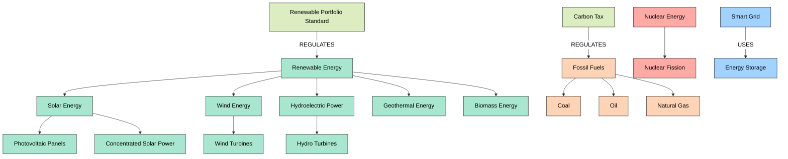

# Energy Taxonomy Example

This example demonstrates how to use ATLAS Framework to create a comprehensive energy taxonomy. It covers the entire workflow from configuration to extraction, validation, enhancement, and visualization.

## Overview

The energy taxonomy example creates a knowledge graph of energy terms, sources, technologies, and their relationships. It includes:

1. **Configuration**: Setting up the taxonomy structure
2. **Extraction**: Extracting terms from various sources
3. **Validation**: Validating the extracted terms
4. **Enhancement**: Enhancing terms with additional information
5. **Relationship Discovery**: Discovering relationships between terms
6. **Visualization**: Visualizing the taxonomy
7. **Export**: Exporting the taxonomy for use in other systems

## Prerequisites

Before running this example, make sure you have:

- Installed ATLAS Framework (see [Installation Guide](../getting-started/installation.md))
- Basic understanding of energy terminology
- Neo4j database (optional, for advanced features)

## Step 1: Configuration

First, let's create a configuration file for our energy taxonomy:

```python
from atlas import ConfigBuilder

# Create configuration builder
config_builder = ConfigBuilder()

# Define node types
config_builder.add_node_type(
    name="energy_term",
    labels=["EnergyTerm", "TaxonomyNode"],
    properties={
        "name": {"type": "string", "required": True},
        "definition": {"type": "string", "required": True},
        "fuel_group": {"type": "string", "required": False, "enum": ["renewable", "fossil", "nuclear", "alternative"]}
    }
)

config_builder.add_node_type(
    name="energy_source",
    labels=["EnergySource", "TaxonomyNode"],
    properties={
        "name": {"type": "string", "required": True},
        "description": {"type": "string", "required": True},
        "renewable": {"type": "boolean", "required": True},
        "carbon_intensity": {"type": "number", "required": False, "min": 0, "max": 1}
    }
)

config_builder.add_node_type(
    name="energy_technology",
    labels=["EnergyTechnology", "TaxonomyNode"],
    properties={
        "name": {"type": "string", "required": True},
        "description": {"type": "string", "required": True},
        "maturity_level": {"type": "string", "required": False, "enum": ["research", "development", "commercial", "mature"]}
    }
)

config_builder.add_node_type(
    name="energy_policy",
    labels=["EnergyPolicy", "TaxonomyNode"],
    properties={
        "name": {"type": "string", "required": True},
        "description": {"type": "string", "required": True},
        "jurisdiction": {"type": "string", "required": False},
        "year_enacted": {"type": "integer", "required": False}
    }
)

# Define relationship types
config_builder.add_relationship_type(
    name="IS_A",
    description="Indicates that one node is a type or subclass of another"
)

config_builder.add_relationship_type(
    name="PART_OF",
    description="Indicates that one node is a part or component of another"
)

config_builder.add_relationship_type(
    name="USES",
    description="Indicates that one node uses or utilizes another"
)

config_builder.add_relationship_type(
    name="PRODUCES",
    description="Indicates that one node produces or generates another"
)

config_builder.add_relationship_type(
    name="REGULATES",
    description="Indicates that one node regulates or governs another"
)

# Define extraction settings
config_builder.set_extraction_settings(
    default_depth="comprehensive",
    default_strategy="agentic_llm",
    confidence_threshold=0.7
)

# Define validation settings
config_builder.set_validation_settings(
    default_strategy="agentic_llm",
    confidence_threshold=0.8,
    validation_rules=[
        "no_cycles",
        "no_orphans",
        "no_contradictions"
    ]
)

# Save configuration to file
config_path = "energy_taxonomy_config.json"
config_builder.save(config_path)

print(f"Configuration saved to {config_path}")
```

## Step 2: Initialization

Now, let's initialize the ATLAS client with our configuration:

```python
from atlas import ATLASClient

# Initialize client with configuration
client = ATLASClient(config_path="energy_taxonomy_config.json")

# Optional: Connect to Neo4j database
client.connect_to_neo4j(
    uri="bolt://localhost:7687",
    user="neo4j",
    password="password"
)

print("ATLAS client initialized")
```

## Step 3: Extraction

Let's extract energy terms from various sources:

### Extract from Text

```python
# Extract from text
text = """
Renewable energy sources include solar, wind, hydro, geothermal, and biomass.
Solar energy is captured through photovoltaic panels and concentrated solar power systems.
Wind energy is harvested by wind turbines, which convert kinetic energy into electricity.
Hydroelectric power uses the energy of flowing water to generate electricity through turbines.
Geothermal energy harnesses heat from the Earth's core to generate electricity or provide heating.
Biomass energy is derived from organic materials such as plants and animal waste.
Fossil fuels include coal, oil, and natural gas, which are non-renewable and produce carbon emissions.
Nuclear energy is produced through nuclear fission of uranium in reactors.
"""

text_result = client.extract_from_text(
    text=text,
    domain="energy",
    extraction_depth="comprehensive"
)

print(f"Extracted {len(text_result.nodes)} nodes and {len(text_result.relationships)} relationships from text")
```

### Extract from URL

```python
# Extract from URL
url_result = client.extract_from_url(
    url="https://www.eia.gov/tools/glossary/",
    domain="energy",
    extraction_depth="comprehensive"
)

print(f"Extracted {len(url_result.nodes)} nodes and {len(url_result.relationships)} relationships from URL")
```

### Extract from File

```python
# Extract from file
file_result = client.extract_from_file(
    file_path="energy_document.pdf",
    domain="energy",
    extraction_depth="comprehensive"
)

print(f"Extracted {len(file_result.nodes)} nodes and {len(file_result.relationships)} relationships from file")
```

### Extract from Multiple Sources

```python
# Extract from multiple sources
batch_result = client.extract_from_batch(
    sources=[
        {"type": "text", "content": "Energy storage systems include batteries, pumped hydro, and thermal storage."},
        {"type": "url", "content": "https://www.energy.gov/eere/solar/solar-energy-glossary"},
        {"type": "file", "content": "nuclear_energy.pdf"}
    ],
    domain="energy",
    extraction_depth="comprehensive",
    parallel=True
)

print(f"Extracted {len(batch_result.nodes)} nodes and {len(batch_result.relationships)} relationships from batch")
```

## Step 4: Manual Additions

Let's add some nodes and relationships manually:

```python
from atlas import RelationshipType

# Add energy policy nodes
renewable_portfolio_standard = client.create_node(
    node_type="energy_policy",
    properties={
        "name": "Renewable Portfolio Standard",
        "description": "Policy requiring electricity suppliers to produce a specified percentage of their electricity from renewable sources",
        "jurisdiction": "State-level",
        "year_enacted": 2005
    }
)

carbon_tax = client.create_node(
    node_type="energy_policy",
    properties={
        "name": "Carbon Tax",
        "description": "Tax on carbon dioxide emissions from burning fossil fuels",
        "jurisdiction": "National",
        "year_enacted": 2010
    }
)

# Add energy technology nodes
smart_grid = client.create_node(
    node_type="energy_technology",
    properties={
        "name": "Smart Grid",
        "description": "Electricity network that uses digital technology to monitor and manage the transport of electricity",
        "maturity_level": "commercial"
    }
)

energy_storage = client.create_node(
    node_type="energy_technology",
    properties={
        "name": "Energy Storage",
        "description": "Technologies that store energy for later use",
        "maturity_level": "commercial"
    }
)

# Add relationships
renewable_energy = client.find_nodes(properties={"name": "Renewable Energy"})[0]

client.create_relationship(
    start_node=renewable_portfolio_standard,
    end_node=renewable_energy,
    type=RelationshipType.REGULATES
)

fossil_fuels = client.find_nodes(properties={"name": "Fossil Fuels"})[0]

client.create_relationship(
    start_node=carbon_tax,
    end_node=fossil_fuels,
    type=RelationshipType.REGULATES
)

client.create_relationship(
    start_node=smart_grid,
    end_node=energy_storage,
    type=RelationshipType.USES
)

print("Manual additions completed")
```

## Step 5: Validation

Let's validate our taxonomy:

```python
from atlas import ValidationStrategy

# Validate nodes
node_validation = client.validate_nodes(
    labels=["EnergyTerm", "EnergySource", "EnergyTechnology", "EnergyPolicy"],
    validation_strategy=ValidationStrategy.AGENTIC_LLM,
    confidence_threshold=0.8
)

print(f"Node validation results:")
print(f"- Validated: {node_validation.validated_count}")
print(f"- Rejected: {node_validation.rejected_count}")
print(f"- Needs review: {node_validation.needs_review_count}")

# Validate relationships
relationship_validation = client.validate_relationships(
    validation_strategy=ValidationStrategy.AGENTIC_LLM,
    confidence_threshold=0.8
)

print(f"\nRelationship validation results:")
print(f"- Validated: {relationship_validation.validated_count}")
print(f"- Rejected: {relationship_validation.rejected_count}")
print(f"- Needs review: {relationship_validation.needs_review_count}")

# Fix validation issues
for issue in node_validation.issues + relationship_validation.issues:
    if issue.severity == "high":
        print(f"Fixing high-severity issue: {issue.description}")
        issue.apply_fix()

# Validate consistency
consistency_validation = client.validate_consistency(
    rules=["no_cycles", "no_orphans", "no_contradictions"]
)

print(f"\nConsistency validation results:")
print(f"- Valid: {consistency_validation.valid}")
print(f"- Inconsistencies: {len(consistency_validation.inconsistencies)}")

# Fix consistency issues
for inconsistency in consistency_validation.inconsistencies:
    print(f"Fixing inconsistency: {inconsistency.description}")
    inconsistency.apply_fix()
```

## Step 6: Enhancement

Let's enhance our taxonomy with additional information:

```python
from atlas import EnhancementStrategy

# Enhance nodes with additional information
enhancement_result = client.enhance_nodes(
    labels=["EnergyTerm", "EnergySource", "EnergyTechnology", "EnergyPolicy"],
    enhancement_strategy=EnhancementStrategy.AGENTIC_LLM,
    properties_to_enhance=["description", "examples", "external_links"]
)

print(f"Enhancement results:")
print(f"- Enhanced nodes: {enhancement_result.enhanced_count}")
print(f"- Added properties: {enhancement_result.added_properties_count}")
print(f"- Updated properties: {enhancement_result.updated_properties_count}")

# Enhance specific nodes
solar_pv = client.find_nodes(properties={"name": "Solar PV"})[0]

client.enhance_node(
    node=solar_pv,
    enhancement_strategy=EnhancementStrategy.AGENTIC_LLM,
    properties_to_enhance=["efficiency_range", "cost_trends", "market_share"]
)

print(f"\nEnhanced Solar PV node with additional properties")
```

## Step 7: Relationship Discovery

Let's discover additional relationships between terms:

```python
from atlas import RelationshipDiscoveryStrategy

# Discover relationships between nodes
discovery_result = client.discover_relationships(
    node_labels=["EnergyTerm", "EnergySource", "EnergyTechnology", "EnergyPolicy"],
    discovery_strategy=RelationshipDiscoveryStrategy.AGENTIC_LLM,
    relationship_types=["IS_A", "PART_OF", "USES", "PRODUCES", "REGULATES"],
    confidence_threshold=0.7
)

print(f"Relationship discovery results:")
print(f"- Discovered relationships: {discovery_result.discovered_count}")
print(f"- Confidence above 0.9: {discovery_result.high_confidence_count}")
print(f"- Confidence between 0.7 and 0.9: {discovery_result.medium_confidence_count}")

# Validate discovered relationships
client.validate_relationships(
    relationship_ids=discovery_result.relationship_ids,
    validation_strategy=ValidationStrategy.AGENTIC_LLM,
    confidence_threshold=0.8
)

print(f"\nValidated discovered relationships")
```

## Step 8: Analysis

Let's analyze our taxonomy:

```python
# Get taxonomy statistics
stats = client.get_taxonomy_statistics()

print(f"Taxonomy statistics:")
print(f"- Total nodes: {stats.node_count}")
print(f"- Total relationships: {stats.relationship_count}")
print(f"- Node types: {stats.node_type_count}")
print(f"- Relationship types: {stats.relationship_type_count}")

# Get node distribution by type
node_distribution = client.get_node_distribution(group_by="labels")

print(f"\nNode distribution by type:")
for label, count in node_distribution.items():
    print(f"- {label}: {count}")

# Get relationship distribution by type
relationship_distribution = client.get_relationship_distribution()

print(f"\nRelationship distribution by type:")
for rel_type, count in relationship_distribution.items():
    print(f"- {rel_type}: {count}")

# Find central nodes
central_nodes = client.find_central_nodes(
    algorithm="pagerank",
    limit=5
)

print(f"\nTop 5 central nodes:")
for node in central_nodes:
    print(f"- {node.properties.get('name')}: {node.centrality_score}")

# Find communities
communities = client.find_communities(
    algorithm="louvain",
    min_community_size=3
)

print(f"\nCommunities:")
for i, community in enumerate(communities):
    print(f"- Community {i+1}: {len(community.nodes)} nodes")
    print(f"  Top terms: {', '.join([node.properties.get('name') for node in community.top_nodes(3)])}")
```

## Step 9: Visualization

Let's visualize our taxonomy:

```python
# Visualize the entire taxonomy
client.visualize(
    output_path="energy_taxonomy_full.html",
    title="Energy Taxonomy",
    description="Comprehensive taxonomy of energy terms, sources, technologies, and policies"
)

print("Full taxonomy visualization saved to energy_taxonomy_full.html")

# Visualize renewable energy subtaxonomy
renewable_energy = client.find_nodes(properties={"name": "Renewable Energy"})[0]

client.visualize_subtaxonomy(
    root_node=renewable_energy,
    max_depth=2,
    output_path="renewable_energy_subtaxonomy.html",
    title="Renewable Energy Taxonomy",
    description="Taxonomy of renewable energy terms and sources"
)

print("Renewable energy subtaxonomy visualization saved to renewable_energy_subtaxonomy.html")

# Visualize relationship network
client.visualize_relationship_network(
    relationship_type="USES",
    output_path="energy_uses_network.html",
    title="Energy Uses Network",
    description="Network of energy technologies and their uses"
)

print("Energy uses network visualization saved to energy_uses_network.html")

# Visualize taxonomy metrics
client.visualize_metrics(
    metrics=["node_count", "relationship_count", "centrality", "density"],
    output_path="energy_taxonomy_metrics.html",
    title="Energy Taxonomy Metrics",
    description="Metrics and statistics for the energy taxonomy"
)

print("Taxonomy metrics visualization saved to energy_taxonomy_metrics.html")
```

## Step 10: Export

Let's export our taxonomy for use in other systems:

```python
# Export to JSON
client.export_to_json(
    output_path="energy_taxonomy.json",
    include_properties=True,
    pretty_print=True
)

print("Taxonomy exported to energy_taxonomy.json")

# Export to CSV
client.export_to_csv(
    output_directory="energy_taxonomy_csv",
    separate_files=True
)

print("Taxonomy exported to CSV files in energy_taxonomy_csv directory")

# Export to RDF
client.export_to_rdf(
    output_path="energy_taxonomy.rdf",
    format="turtle"
)

print("Taxonomy exported to energy_taxonomy.rdf")

# Export to Neo4j Cypher script
client.export_to_cypher(
    output_path="energy_taxonomy.cypher"
)

print("Taxonomy exported to energy_taxonomy.cypher")

# Export to GraphML
client.export_to_graphml(
    output_path="energy_taxonomy.graphml"
)

print("Taxonomy exported to energy_taxonomy.graphml")
```

## Step 11: Integration

Let's integrate our taxonomy with other systems:

```python
# Create API endpoint
api = client.create_api(
    host="0.0.0.0",
    port=8000,
    endpoints=["nodes", "relationships", "search", "visualization"]
)

print(f"API running at http://localhost:8000")

# Create search index
client.create_search_index(
    index_name="energy_taxonomy",
    node_labels=["EnergyTerm", "EnergySource", "EnergyTechnology", "EnergyPolicy"],
    properties=["name", "definition", "description"]
)

print("Search index created")

# Create embeddings for semantic search
client.create_embeddings(
    node_labels=["EnergyTerm", "EnergySource", "EnergyTechnology", "EnergyPolicy"],
    properties=["name", "definition", "description"],
    model="text-embedding-3-small"
)

print("Embeddings created for semantic search")
```

## Step 12: Maintenance

Let's set up maintenance tasks for our taxonomy:

```python
# Schedule regular updates
client.schedule_update(
    source_type="url",
    source="https://www.eia.gov/tools/glossary/",
    frequency="weekly",
    next_update="2025-08-01T00:00:00Z"
)

print("Scheduled weekly updates from EIA glossary")

# Schedule validation
client.schedule_validation(
    frequency="monthly",
    next_validation="2025-08-15T00:00:00Z",
    validation_strategy=ValidationStrategy.AGENTIC_LLM
)

print("Scheduled monthly validation")

# Set up change tracking
client.enable_change_tracking(
    track_additions=True,
    track_modifications=True,
    track_deletions=True
)

print("Enabled change tracking")

# Set up versioning
client.enable_versioning(
    version_retention_count=10,
    auto_version_on_change=True
)

print("Enabled versioning")
```

## Complete Example

Here's the complete example script:

```python
import os
from atlas import (
    ATLASClient, ConfigBuilder, RelationshipType,
    ValidationStrategy, EnhancementStrategy, RelationshipDiscoveryStrategy
)

# Step 1: Configuration
config_builder = ConfigBuilder()

# Define node types
config_builder.add_node_type(
    name="energy_term",
    labels=["EnergyTerm", "TaxonomyNode"],
    properties={
        "name": {"type": "string", "required": True},
        "definition": {"type": "string", "required": True},
        "fuel_group": {"type": "string", "required": False, "enum": ["renewable", "fossil", "nuclear", "alternative"]}
    }
)

config_builder.add_node_type(
    name="energy_source",
    labels=["EnergySource", "TaxonomyNode"],
    properties={
        "name": {"type": "string", "required": True},
        "description": {"type": "string", "required": True},
        "renewable": {"type": "boolean", "required": True},
        "carbon_intensity": {"type": "number", "required": False, "min": 0, "max": 1}
    }
)

config_builder.add_node_type(
    name="energy_technology",
    labels=["EnergyTechnology", "TaxonomyNode"],
    properties={
        "name": {"type": "string", "required": True},
        "description": {"type": "string", "required": True},
        "maturity_level": {"type": "string", "required": False, "enum": ["research", "development", "commercial", "mature"]}
    }
)

config_builder.add_node_type(
    name="energy_policy",
    labels=["EnergyPolicy", "TaxonomyNode"],
    properties={
        "name": {"type": "string", "required": True},
        "description": {"type": "string", "required": True},
        "jurisdiction": {"type": "string", "required": False},
        "year_enacted": {"type": "integer", "required": False}
    }
)

# Define relationship types
config_builder.add_relationship_type(
    name="IS_A",
    description="Indicates that one node is a type or subclass of another"
)

config_builder.add_relationship_type(
    name="PART_OF",
    description="Indicates that one node is a part or component of another"
)

config_builder.add_relationship_type(
    name="USES",
    description="Indicates that one node uses or utilizes another"
)

config_builder.add_relationship_type(
    name="PRODUCES",
    description="Indicates that one node produces or generates another"
)

config_builder.add_relationship_type(
    name="REGULATES",
    description="Indicates that one node regulates or governs another"
)

# Define extraction settings
config_builder.set_extraction_settings(
    default_depth="comprehensive",
    default_strategy="agentic_llm",
    confidence_threshold=0.7
)

# Define validation settings
config_builder.set_validation_settings(
    default_strategy="agentic_llm",
    confidence_threshold=0.8,
    validation_rules=[
        "no_cycles",
        "no_orphans",
        "no_contradictions"
    ]
)

# Save configuration to file
config_path = "energy_taxonomy_config.json"
config_builder.save(config_path)

print(f"Configuration saved to {config_path}")

# Step 2: Initialization
client = ATLASClient(config_path=config_path)

# Optional: Connect to Neo4j database
# client.connect_to_neo4j(
#     uri="bolt://localhost:7687",
#     user="neo4j",
#     password="password"
# )

print("ATLAS client initialized")

# Step 3: Extraction
# Extract from text
text = """
Renewable energy sources include solar, wind, hydro, geothermal, and biomass.
Solar energy is captured through photovoltaic panels and concentrated solar power systems.
Wind energy is harvested by wind turbines, which convert kinetic energy into electricity.
Hydroelectric power uses the energy of flowing water to generate electricity through turbines.
Geothermal energy harnesses heat from the Earth's core to generate electricity or provide heating.
Biomass energy is derived from organic materials such as plants and animal waste.
Fossil fuels include coal, oil, and natural gas, which are non-renewable and produce carbon emissions.
Nuclear energy is produced through nuclear fission of uranium in reactors.
"""

text_result = client.extract_from_text(
    text=text,
    domain="energy",
    extraction_depth="comprehensive"
)

print(f"Extracted {len(text_result.nodes)} nodes and {len(text_result.relationships)} relationships from text")

# Step 4: Manual Additions
# Add energy policy nodes
renewable_portfolio_standard = client.create_node(
    node_type="energy_policy",
    properties={
        "name": "Renewable Portfolio Standard",
        "description": "Policy requiring electricity suppliers to produce a specified percentage of their electricity from renewable sources",
        "jurisdiction": "State-level",
        "year_enacted": 2005
    }
)

carbon_tax = client.create_node(
    node_type="energy_policy",
    properties={
        "name": "Carbon Tax",
        "description": "Tax on carbon dioxide emissions from burning fossil fuels",
        "jurisdiction": "National",
        "year_enacted": 2010
    }
)

# Add energy technology nodes
smart_grid = client.create_node(
    node_type="energy_technology",
    properties={
        "name": "Smart Grid",
        "description": "Electricity network that uses digital technology to monitor and manage the transport of electricity",
        "maturity_level": "commercial"
    }
)

energy_storage = client.create_node(
    node_type="energy_technology",
    properties={
        "name": "Energy Storage",
        "description": "Technologies that store energy for later use",
        "maturity_level": "commercial"
    }
)

# Add relationships
renewable_energy = client.find_nodes(properties={"name": "Renewable Energy"})[0]

client.create_relationship(
    start_node=renewable_portfolio_standard,
    end_node=renewable_energy,
    type=RelationshipType.REGULATES
)

fossil_fuels = client.find_nodes(properties={"name": "Fossil Fuels"})[0]

client.create_relationship(
    start_node=carbon_tax,
    end_node=fossil_fuels,
    type=RelationshipType.REGULATES
)

client.create_relationship(
    start_node=smart_grid,
    end_node=energy_storage,
    type=RelationshipType.USES
)

print("Manual additions completed")

# Step 5: Validation
node_validation = client.validate_nodes(
    labels=["EnergyTerm", "EnergySource", "EnergyTechnology", "EnergyPolicy"],
    validation_strategy=ValidationStrategy.AGENTIC_LLM,
    confidence_threshold=0.8
)

print(f"Node validation results:")
print(f"- Validated: {node_validation.validated_count}")
print(f"- Rejected: {node_validation.rejected_count}")
print(f"- Needs review: {node_validation.needs_review_count}")

relationship_validation = client.validate_relationships(
    validation_strategy=ValidationStrategy.AGENTIC_LLM,
    confidence_threshold=0.8
)

print(f"\nRelationship validation results:")
print(f"- Validated: {relationship_validation.validated_count}")
print(f"- Rejected: {relationship_validation.rejected_count}")
print(f"- Needs review: {relationship_validation.needs_review_count}")

# Step 6: Enhancement
enhancement_result = client.enhance_nodes(
    labels=["EnergyTerm", "EnergySource", "EnergyTechnology", "EnergyPolicy"],
    enhancement_strategy=EnhancementStrategy.AGENTIC_LLM,
    properties_to_enhance=["description", "examples", "external_links"]
)

print(f"Enhancement results:")
print(f"- Enhanced nodes: {enhancement_result.enhanced_count}")
print(f"- Added properties: {enhancement_result.added_properties_count}")
print(f"- Updated properties: {enhancement_result.updated_properties_count}")

# Step 7: Relationship Discovery
discovery_result = client.discover_relationships(
    node_labels=["EnergyTerm", "EnergySource", "EnergyTechnology", "EnergyPolicy"],
    discovery_strategy=RelationshipDiscoveryStrategy.AGENTIC_LLM,
    relationship_types=["IS_A", "PART_OF", "USES", "PRODUCES", "REGULATES"],
    confidence_threshold=0.7
)

print(f"Relationship discovery results:")
print(f"- Discovered relationships: {discovery_result.discovered_count}")
print(f"- Confidence above 0.9: {discovery_result.high_confidence_count}")
print(f"- Confidence between 0.7 and 0.9: {discovery_result.medium_confidence_count}")

# Step 8: Analysis
stats = client.get_taxonomy_statistics()

print(f"Taxonomy statistics:")
print(f"- Total nodes: {stats.node_count}")
print(f"- Total relationships: {stats.relationship_count}")
print(f"- Node types: {stats.node_type_count}")
print(f"- Relationship types: {stats.relationship_type_count}")

# Step 9: Visualization
client.visualize(
    output_path="energy_taxonomy_full.html",
    title="Energy Taxonomy",
    description="Comprehensive taxonomy of energy terms, sources, technologies, and policies"
)

print("Full taxonomy visualization saved to energy_taxonomy_full.html")

client.visualize_subtaxonomy(
    root_node=renewable_energy,
    max_depth=2,
    output_path="renewable_energy_subtaxonomy.html",
    title="Renewable Energy Taxonomy",
    description="Taxonomy of renewable energy terms and sources"
)

print("Renewable energy subtaxonomy visualization saved to renewable_energy_subtaxonomy.html")

# Step 10: Export
client.export_to_json(
    output_path="energy_taxonomy.json",
    include_properties=True,
    pretty_print=True
)

print("Taxonomy exported to energy_taxonomy.json")

# Create output directory for CSV files
os.makedirs("energy_taxonomy_csv", exist_ok=True)

client.export_to_csv(
    output_directory="energy_taxonomy_csv",
    separate_files=True
)

print("Taxonomy exported to CSV files in energy_taxonomy_csv directory")

print("Energy taxonomy example completed successfully!")
```

## Visualization

Here's a preview of the energy taxonomy visualization:



## Next Steps

Now that you've created a comprehensive energy taxonomy, you can:

- Integrate it with other systems using the [API](../api/core.md)
- Extend it with custom [Behaviors](../features/behaviors.md)
- Set up automated updates using [Scheduled Tasks](../features/scheduled-tasks.md)
- Explore advanced [Graph Analysis](../features/graph-analysis.md) techniques

