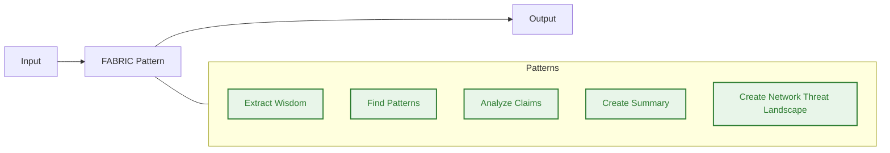
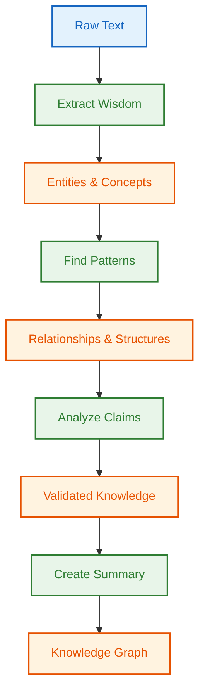
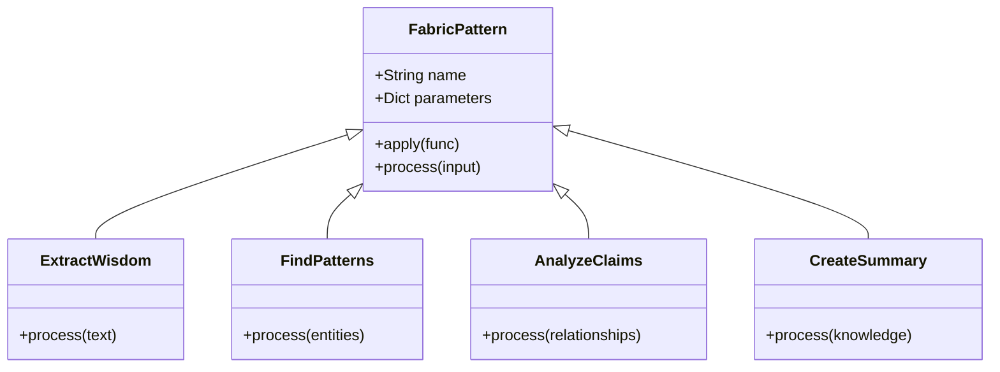
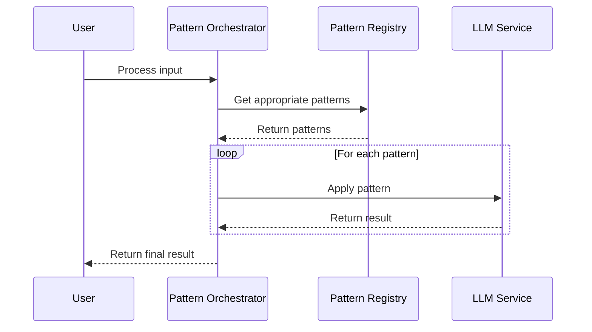
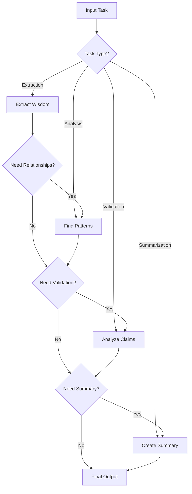
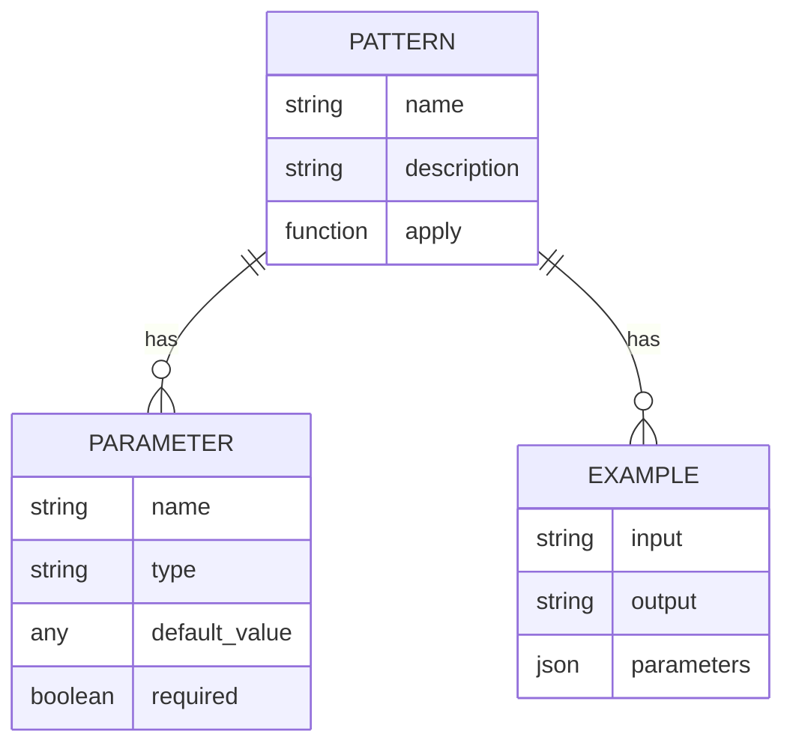
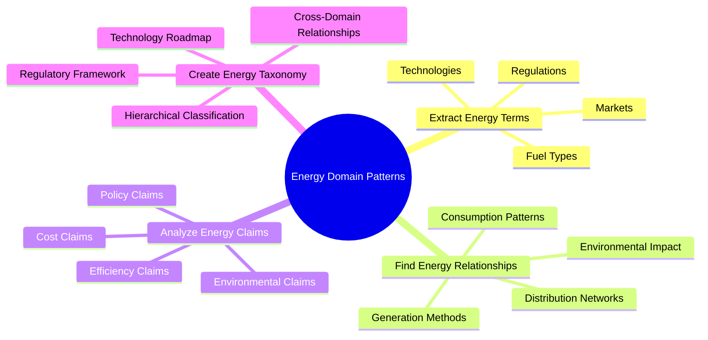
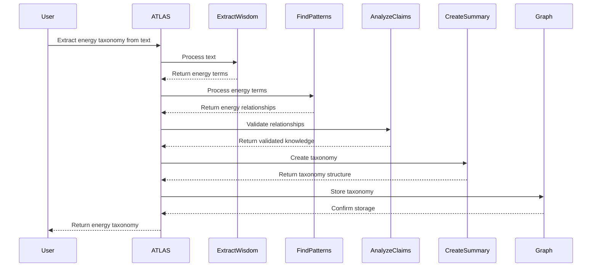

# FABRIC Patterns

The ATLAS Framework leverages Daniel Meissler's FABRIC patterns for agentic LLM orchestration. This page explains the patterns and how they are implemented in the framework.

## What are FABRIC Patterns?

FABRIC patterns are a collection of prompt engineering patterns that enable LLMs to perform complex reasoning tasks. They provide a structured approach to decomposing complex problems into manageable steps.



## Pattern Composition

FABRIC patterns can be composed to create complex workflows. The ATLAS Framework uses this composition to create sophisticated knowledge extraction and analysis pipelines.



## Pattern Implementation

The ATLAS Framework implements FABRIC patterns as decorators that can be applied to functions. This allows for flexible composition and reuse of patterns.



## Pattern Orchestration

The ATLAS Framework uses a pattern orchestrator to manage the execution of FABRIC patterns. The orchestrator selects the appropriate patterns based on the input and desired output.



## Pattern Selection

The ATLAS Framework uses a decision tree to select the appropriate patterns for a given task. This ensures that the most effective patterns are used for each specific use case.



## Pattern Configuration

Each FABRIC pattern in the ATLAS Framework can be configured with specific parameters to customize its behavior. This allows for fine-tuning of the patterns for specific domains and use cases.



## Energy Domain Patterns

The ATLAS Framework includes specialized FABRIC patterns for the energy domain. These patterns are designed to extract and analyze energy-specific concepts and relationships.



## Pattern Usage Example

Here's an example of how FABRIC patterns are used in the ATLAS Framework to extract and analyze energy taxonomy from text.



## Pattern Performance Metrics

The ATLAS Framework tracks performance metrics for each FABRIC pattern to optimize their usage and improve results over time.

```mermaid
xychart-beta
    title "FABRIC Pattern Performance"
    x-axis "Pattern" ["Extract Wisdom", "Find Patterns", "Analyze Claims", "Create Summary"]
    y-axis "Accuracy (%)" [0, 20, 40, 60, 80, 100]
    bar [85, 78, 92, 88]
```

These diagrams provide a comprehensive view of how FABRIC patterns are implemented and used in the ATLAS Framework for knowledge extraction and analysis.

