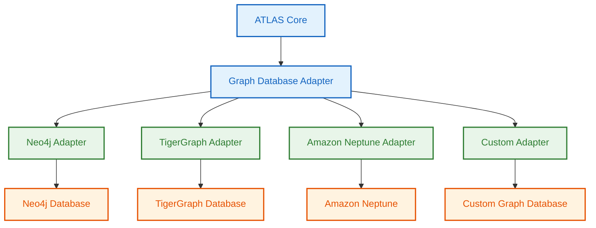
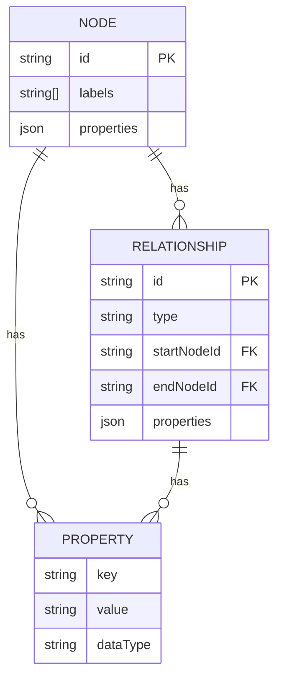
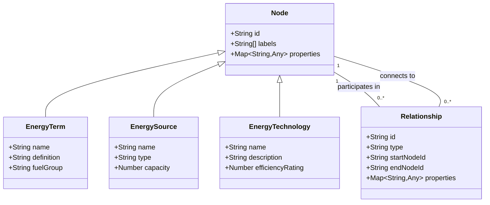
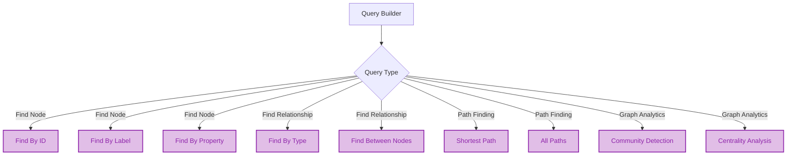
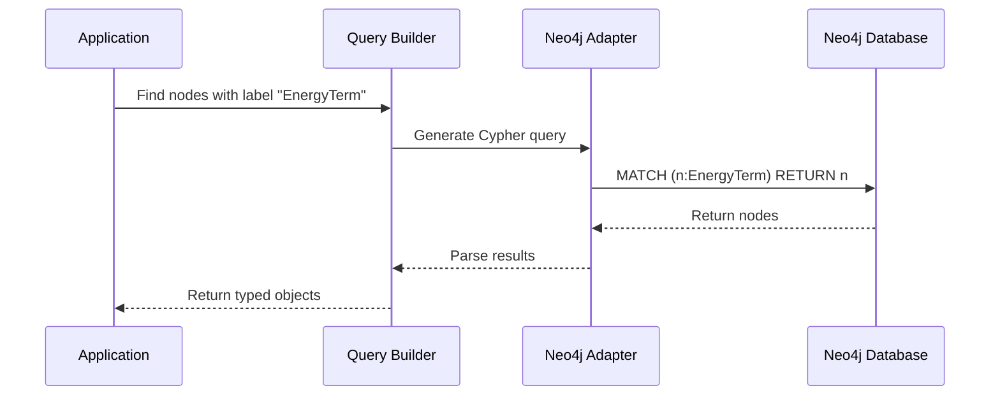
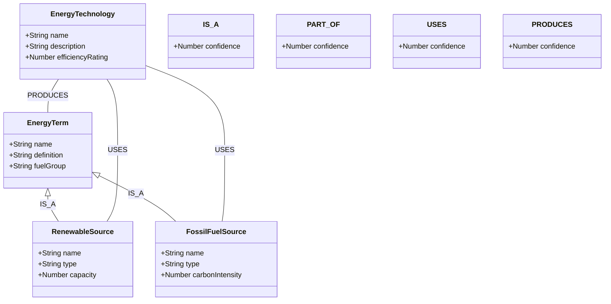
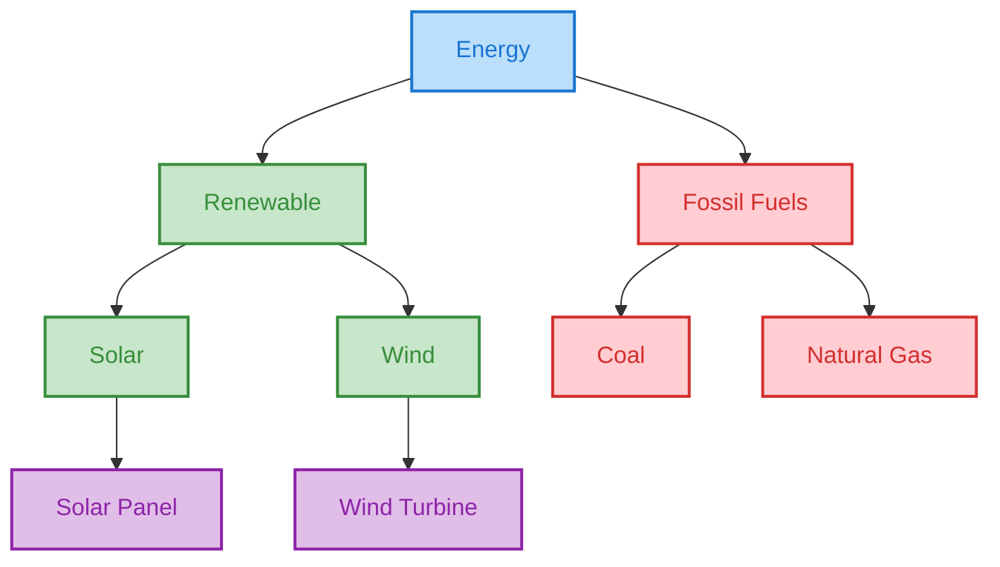
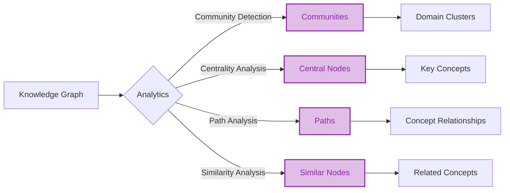
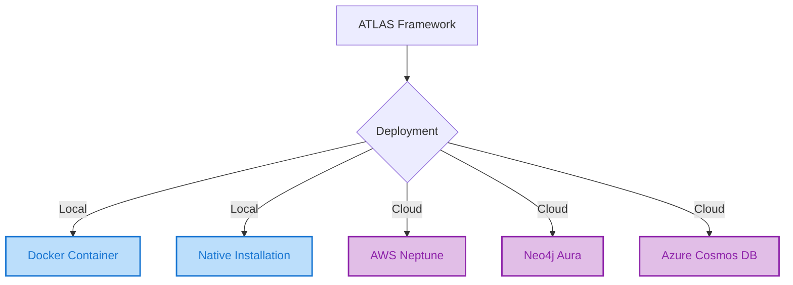
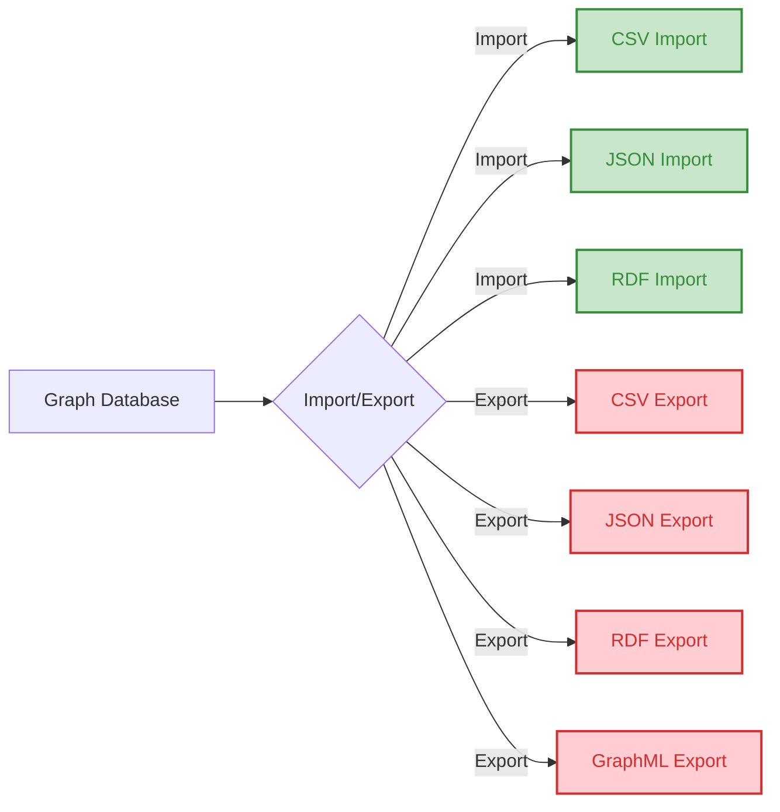

# Graph Database Integration

The ATLAS Framework uses graph databases to store and query knowledge graphs. This page explains how graph databases are integrated into the framework and how they are used to represent taxonomies.

## Graph Database Architecture

The ATLAS Framework uses Neo4j as its primary graph database, but it's designed to be database-agnostic with adapters for different graph database systems.



## Data Model

The ATLAS Framework uses a flexible data model that can represent complex taxonomies and their relationships.



## Node and Relationship Types

The ATLAS Framework defines a set of standard node and relationship types for representing taxonomies.



## Query Patterns

The ATLAS Framework provides a set of standard query patterns for interacting with the graph database.



## Cypher Query Examples

The ATLAS Framework generates Cypher queries for Neo4j based on high-level query specifications.



## Graph Schema

The ATLAS Framework uses a flexible schema that can be extended for different domains.



## Graph Visualization

The ATLAS Framework provides tools for visualizing the knowledge graph.



## Graph Analytics

The ATLAS Framework provides tools for analyzing the knowledge graph to extract insights.



## Graph Database Performance

The ATLAS Framework is designed to handle large knowledge graphs efficiently.

```mermaid
xychart-beta
    title "Graph Database Performance"
    x-axis "Nodes (thousands)" [10, 50, 100, 500, 1000]
    y-axis "Query Time (ms)" [0, 50, 100, 150, 200, 250]
    line [15, 35, 60, 120, 220]
```

## Graph Database Deployment

The ATLAS Framework supports different deployment options for the graph database.



## Data Import/Export

The ATLAS Framework provides tools for importing and exporting data from the graph database.



These diagrams provide a comprehensive view of how graph databases are integrated into the ATLAS Framework for storing and querying knowledge graphs.

