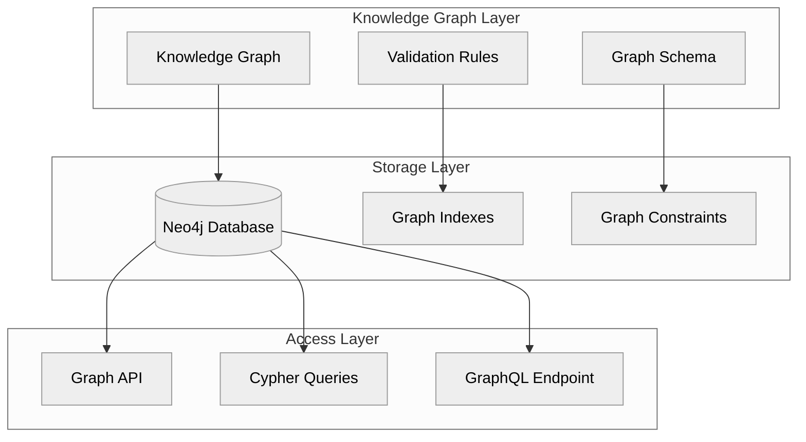

# Knowledge Graph

The ATLAS Framework provides powerful capabilities for building, managing, and leveraging knowledge graphs. This page explains how knowledge graphs work in ATLAS and how to use them effectively.

## What is a Knowledge Graph?

A knowledge graph is a structured representation of knowledge that consists of:

- **Nodes**: Entities or concepts (e.g., "Solar PV", "Renewable Energy")
- **Relationships**: Connections between nodes (e.g., "Solar PV" IS_A "Renewable Energy")
- **Properties**: Attributes of nodes and relationships (e.g., name, definition, confidence score)

Knowledge graphs excel at representing complex, interconnected information and enabling sophisticated queries and insights.

## Knowledge Graph Architecture

ATLAS Framework implements knowledge graphs using Neo4j as the underlying graph database:



### Graph Schema

ATLAS Framework uses a flexible schema approach that balances structure and adaptability:

- **Node Labels**: Categories for nodes (e.g., "EnergyTerm", "RenewableSource")
- **Relationship Types**: Categories for relationships (e.g., "IS_A", "PART_OF")
- **Property Keys**: Standardized property names
- **Constraints**: Rules to ensure data integrity
- **Indexes**: Optimizations for query performance

### Node Structure

Nodes in ATLAS knowledge graphs have the following structure:

```json
{
  "id": "12345",
  "labels": ["EnergyTerm", "RenewableSource"],
  "properties": {
    "name": "Solar PV",
    "definition": "Photovoltaic technology that converts sunlight into electricity",
    "fuel_group": "renewable",
    "created_at": "2025-01-15T10:00:00Z",
    "confidence_score": 0.95,
    "validation_status": "validated"
  }
}
```

### Relationship Structure

Relationships in ATLAS knowledge graphs have the following structure:

```json
{
  "id": "67890",
  "type": "IS_A",
  "start_node_id": "12345",  // Solar PV
  "end_node_id": "54321",    // Renewable Energy
  "properties": {
    "confidence_score": 0.92,
    "source": "expert_validation",
    "created_at": "2025-01-15T10:05:00Z"
  }
}
```

## Building Knowledge Graphs

ATLAS Framework provides several ways to build knowledge graphs:

### 1. Automatic Extraction

Use agentic LLMs to automatically extract knowledge from text sources:

```python
from atlas import ATLASClient

# Initialize client
client = ATLASClient()

# Extract knowledge from a URL
result = client.extract_from_url(
    url="https://www.eia.gov/tools/glossary/",
    domain="energy",
    extraction_depth="comprehensive"
)

# Extract knowledge from text
text = """
Solar photovoltaic (PV) is a technology that converts sunlight
directly into electricity. Solar PV cells are made from silicon
and other materials that exhibit the photovoltaic effect.
"""

result = client.extract_from_text(
    text=text,
    domain="energy",
    extraction_depth="comprehensive"
)
```

### 2. Manual Creation

Create nodes and relationships manually:

```python
from atlas import ATLASClient, RelationshipType

# Initialize client
client = ATLASClient()

# Create nodes
solar_pv = client.create_node(
    labels=["EnergyTerm", "RenewableSource"],
    properties={
        "name": "Solar PV",
        "definition": "Photovoltaic technology that converts sunlight into electricity",
        "fuel_group": "renewable"
    }
)

renewable_energy = client.create_node(
    labels=["EnergyTerm", "Category"],
    properties={
        "name": "Renewable Energy",
        "definition": "Energy derived from natural processes that are replenished constantly",
        "fuel_group": "renewable"
    }
)

# Create relationship
client.create_relationship(
    start_node=solar_pv,
    end_node=renewable_energy,
    type=RelationshipType.IS_A,
    properties={
        "confidence_score": 1.0,
        "source": "manual"
    }
)
```

### 3. Hybrid Approach

Combine automatic extraction with manual refinement:

```python
from atlas import ATLASClient

# Initialize client
client = ATLASClient()

# Extract initial knowledge
result = client.extract_from_url(
    url="https://www.eia.gov/tools/glossary/",
    domain="energy",
    extraction_depth="comprehensive"
)

# Refine the knowledge graph
for node in result.nodes:
    if node.properties.get("confidence_score", 0) < 0.8:
        # Review and update low-confidence nodes
        client.update_node(
            node_id=node.id,
            properties={
                "validation_status": "needs_review",
                "review_priority": "high"
            }
        )
```

## Querying Knowledge Graphs

ATLAS Framework provides multiple ways to query knowledge graphs:

### 1. Python API

Use the Python API for programmatic access:

```python
from atlas import ATLASClient

# Initialize client
client = ATLASClient()

# Find nodes by label
renewable_nodes = client.find_nodes(
    labels=["RenewableSource"],
    limit=100
)

# Find nodes by property
solar_nodes = client.find_nodes(
    properties={"name": "Solar PV"}
)

# Find relationships
is_a_relationships = client.find_relationships(
    relationship_type="IS_A",
    start_node_labels=["EnergyTerm"],
    end_node_labels=["Category"]
)

# Path queries
paths = client.find_paths(
    start_node_properties={"name": "Solar PV"},
    end_node_properties={"name": "Energy"},
    max_depth=3
)
```

### 2. Cypher Queries

Use Cypher, Neo4j's query language, for advanced queries:

```python
from atlas import ATLASClient

# Initialize client
client = ATLASClient()

# Execute Cypher query
result = client.execute_cypher("""
    MATCH (n:EnergyTerm)-[:IS_A]->(c:Category)
    WHERE c.name = 'Renewable Energy'
    RETURN n.name, n.definition, n.fuel_group
""")

# Process results
for record in result:
    print(f"Name: {record['n.name']}")
    print(f"Definition: {record['n.definition']}")
    print(f"Fuel Group: {record['n.fuel_group']}")
    print("---")
```

### 3. GraphQL API

Use the GraphQL API for flexible querying:

```graphql
query {
  energyTerms(filter: { fuelGroup: "renewable" }) {
    name
    definition
    categories {
      name
      definition
    }
    relatedTerms {
      name
      relationshipType
    }
  }
}
```

## Visualizing Knowledge Graphs

ATLAS Framework provides built-in visualization capabilities:

```python
from atlas import ATLASClient

# Initialize client
client = ATLASClient()

# Generate visualization
client.visualize(
    start_node_properties={"name": "Solar PV"},
    max_depth=2,
    output_path="solar_pv_graph.html"
)
```

This generates an interactive HTML visualization that you can open in a web browser.

## Knowledge Graph Validation

ATLAS Framework provides comprehensive validation capabilities:

### 1. Automatic Validation

Use agentic LLMs to automatically validate knowledge:

```python
from atlas import ATLASClient

# Initialize client
client = ATLASClient()

# Validate nodes
validation_result = client.validate_nodes(
    labels=["EnergyTerm"],
    validation_strategy="llm_consensus",
    confidence_threshold=0.8
)

print(f"Validated: {validation_result.validated_count}")
print(f"Rejected: {validation_result.rejected_count}")
print(f"Needs review: {validation_result.needs_review_count}")
```

### 2. Schema Validation

Validate against schema constraints:

```python
from atlas import ATLASClient

# Initialize client
client = ATLASClient()

# Validate against schema
schema_validation = client.validate_schema(
    node_types=["EnergyTerm", "Category"],
    relationship_types=["IS_A", "PART_OF"]
)

# Fix schema violations
for violation in schema_validation.violations:
    print(f"Violation: {violation.message}")
    print(f"Node ID: {violation.node_id}")
    print(f"Fix: {violation.suggested_fix}")
    
    # Apply fix
    if violation.can_auto_fix:
        client.apply_schema_fix(violation.id)
```

### 3. Consistency Validation

Validate logical consistency of the knowledge graph:

```python
from atlas import ATLASClient

# Initialize client
client = ATLASClient()

# Validate consistency
consistency_result = client.validate_consistency(
    rules=["no_cycles", "no_orphans", "no_contradictions"]
)

# Review inconsistencies
for inconsistency in consistency_result.inconsistencies:
    print(f"Type: {inconsistency.type}")
    print(f"Description: {inconsistency.description}")
    print(f"Affected nodes: {inconsistency.affected_node_ids}")
    print(f"Suggested resolution: {inconsistency.suggested_resolution}")
```

## Advanced Features

### 1. Knowledge Graph Enrichment

Enrich your knowledge graph with additional information:

```python
from atlas import ATLASClient

# Initialize client
client = ATLASClient()

# Enrich nodes with additional information
enrichment_result = client.enrich_nodes(
    labels=["EnergyTerm"],
    enrichment_sources=["wikipedia", "dbpedia", "wikidata"],
    properties_to_enrich=["description", "examples", "external_links"]
)

print(f"Enriched {enrichment_result.enriched_count} nodes")
```

### 2. Knowledge Graph Inference

Infer new relationships based on existing knowledge:

```python
from atlas import ATLASClient

# Initialize client
client = ATLASClient()

# Infer new relationships
inference_result = client.infer_relationships(
    inference_rules=["transitivity", "symmetry", "inverse"],
    confidence_threshold=0.7
)

print(f"Inferred {inference_result.inferred_count} new relationships")
```

### 3. Knowledge Graph Export

Export your knowledge graph in various formats:

```python
from atlas import ATLASClient

# Initialize client
client = ATLASClient()

# Export to JSON
client.export_to_json(
    output_path="energy_taxonomy.json",
    include_properties=True,
    pretty_print=True
)

# Export to CSV
client.export_to_csv(
    output_directory="energy_taxonomy_csv",
    separate_files=True
)

# Export to RDF
client.export_to_rdf(
    output_path="energy_taxonomy.rdf",
    format="turtle"
)
```

## Best Practices

### 1. Node Naming

- Use clear, concise names for nodes
- Follow a consistent naming convention
- Avoid abbreviations unless they are standard in the domain

### 2. Relationship Types

- Use descriptive relationship types
- Define a controlled vocabulary of relationship types
- Document the semantics of each relationship type

### 3. Property Management

- Define required properties for each node type
- Use consistent property names across node types
- Include metadata properties (e.g., creation date, source)

### 4. Validation Strategy

- Validate nodes and relationships as they are created
- Implement regular validation checks
- Use multiple validation strategies for critical data

### 5. Performance Optimization

- Create indexes for frequently queried properties
- Use appropriate node labels for efficient filtering
- Limit the depth of traversal queries

## Next Steps

Now that you understand knowledge graphs in ATLAS Framework, you can:

- Learn about [Agentic LLMs](agentic-llms.md) for automatic extraction
- Explore [FABRIC Patterns](fabric-patterns.md) for intelligent behavior
- Understand [Graph Database](graph-database.md) integration
- See [Examples](../examples/energy-taxonomy.md) of knowledge graphs in action

