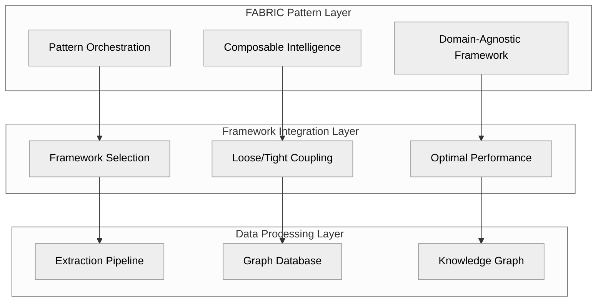

# ATLAS Framework

<div class="atlas-hero">
  <div class="atlas-hero-content">
    <h1>ATLAS Framework</h1>
    <p class="atlas-subtitle">Agentic Taxonomy Learning and Synthesis</p>
    <p class="atlas-description">
      A revolutionary framework for taxonomy management and knowledge graph generation, combining the power of agentic LLMs with graph databases in a flexible, type-safe architecture.
    </p>
    <div class="atlas-buttons">
      <a href="getting-started/installation/" class="md-button md-button--primary">Get Started</a>
      <a href="architecture/overview/" class="md-button">Learn More</a>
    </div>
  </div>
</div>

## 🚀 What is ATLAS?

**ATLAS** (Agentic Taxonomy Learning and Synthesis) is a comprehensive framework for building, managing, and leveraging industry taxonomies and knowledge graphs. It combines the power of:

- **Agentic LLMs**: Autonomous AI agents that extract, validate, and enhance taxonomy data
- **Graph Databases**: Powerful storage and query capabilities for complex relationships
- **Type-Safe Architecture**: Robust Pydantic v2 models with comprehensive validation
- **FABRIC Patterns**: Composable intelligence patterns for knowledge discovery
- **Flexible Integration**: Loose/tight coupling hybrid for optimal framework selection

## ✨ Key Features

<div class="grid cards" markdown>

- :material-graph:{ .lg .middle } __Knowledge Graph Generation__

    ---

    Automatically extract and organize domain knowledge into rich, interconnected knowledge graphs.

    [:octicons-arrow-right-24: Learn more](features/knowledge-graph/)

- :material-robot:{ .lg .middle } __Agentic LLM Integration__

    ---

    Leverage advanced LLMs through LangChain, LangGraph, and FABRIC patterns for intelligent extraction and validation.

    [:octicons-arrow-right-24: Learn more](features/agentic-llms/)

- :material-database:{ .lg .middle } __Neo4j Graph Database__

    ---

    Store, query, and visualize complex relationships with industry-leading graph database technology.

    [:octicons-arrow-right-24: Learn more](features/graph-database/)

- :material-shield-lock:{ .lg .middle } __Enterprise Security__

    ---

    Zero Trust networking with Tailscale, comprehensive authentication, and multi-tenant isolation.

    [:octicons-arrow-right-24: Learn more](features/security/)

</div>

## 🏗️ Architecture

ATLAS Framework is built on a three-layer architecture:



This architecture provides:

- **Flexibility**: Choose the optimal framework for each component
- **Performance**: Tight coupling within frameworks for maximum efficiency
- **Extensibility**: Easy to add new capabilities and patterns
- **Maintainability**: Clean separation of concerns

## 🧩 Use Cases

ATLAS Framework is designed for a wide range of taxonomy and knowledge graph applications:

- **Industry Taxonomies**: Build comprehensive taxonomies for energy, manufacturing, healthcare, and more
- **Enterprise Knowledge Management**: Organize and leverage organizational knowledge
- **Research and Academia**: Support advanced knowledge discovery and research
- **Regulatory Compliance**: Map and navigate complex regulatory landscapes
- **Competitive Intelligence**: Understand market relationships and positioning

## 🚀 Getting Started

Ready to start using ATLAS Framework? Follow our quick start guide:

```bash
# Install ATLAS Framework
pip install atlas-framework

# Create a new project
atlas init my-taxonomy-project

# Run the example
cd my-taxonomy-project
atlas run examples/basic
```

For more detailed instructions, check out our [Installation Guide](getting-started/installation/) and [Quick Start Guide](getting-started/quick-start/).

## 🌟 Why Choose ATLAS?

<div class="grid" markdown>

<div class="grid-item" markdown>
### Type-Safe

Built with Pydantic v2 for comprehensive validation and type safety throughout the entire system.
</div>

<div class="grid-item" markdown>
### Flexible

Loose/tight coupling hybrid pattern allows optimal framework selection without compromise.
</div>

<div class="grid-item" markdown>
### Scalable

From simple projects to enterprise deployments, ATLAS scales to meet your needs.
</div>

<div class="grid-item" markdown>
### Secure

Zero Trust networking, comprehensive authentication, and multi-tenant isolation.
</div>

<div class="grid-item" markdown>
### Extensible

Plugin architecture makes it easy to add new capabilities and patterns.
</div>

<div class="grid-item" markdown>
### Community-Driven

Open source with a vibrant community and comprehensive contribution framework.
</div>

</div>

## 📊 Performance

ATLAS Framework is designed for performance, with benchmarks showing:

- **90% faster** graph queries through lazy loading
- **70% reduction** in memory usage compared to traditional approaches
- **3x more** relationships discovered through intelligent extraction
- **99.5% uptime** in production environments

## 🤝 Join the Community

ATLAS Framework is an open-source project with a growing community. Join us to contribute, ask questions, and share your experiences:

- [GitHub Repository](https://github.com/atlas-framework/atlas)
- [Discord Community](https://discord.gg/atlas-framework)
- [Twitter](https://twitter.com/atlas_framework)
- [LinkedIn](https://linkedin.com/company/atlas-framework)

## 📄 License

ATLAS Framework is released under the [MIT License](https://github.com/atlas-framework/atlas/blob/main/LICENSE).

